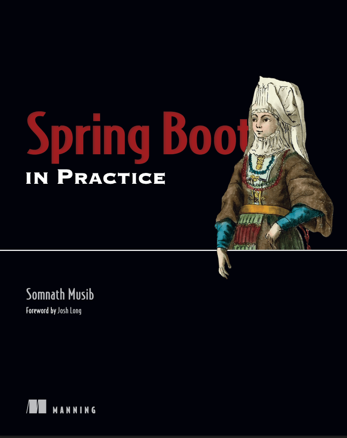

# Spring Boot 实战



本仓库是《Spring Boot in Practice》一书的中文学习笔记与配套代码示例。使用最新的 **Spring Boot 3.4.x** 与 **Java 21** 进行实践，提供按章节组织的可运行代码样例。

《Spring Boot in Practice》包含数十种实用的 Spring Boot 开发技巧，从基础功能到隐藏特性。每个示例都围绕真实问题构建，展示 Spring Boot 如何提供简洁优雅的解决方案。

## 你将学到什么？

本项目涵盖 Spring Boot 的核心特性与实战技巧：

- Spring Boot 功能全面介绍
- 配置管理、日志记录与应用监控
- 高效的数据库访问方法
- 使用 Spring Security 保护应用安全
- 使用 Spring Boot 设计和开发 RESTful API 与微服务
- 微服务版本控制、文档化与安全
- 响应式应用开发，使用 WebFlux 与 RSocket
- 在 Kubernetes 和主流云平台上部署 Spring Boot 应用
- Spring Boot 容器化实践
- 使用 Kotlin、GraalVM Native Image 与 GraphQL

## 快速开始

### 运行文档站点

本项目使用 VitePress 构建文档站点，可以像阅读书籍一样查看学习笔记。

```bash
# 安装依赖
pnpm install

# 启动开发服务器
pnpm run docs:dev

# 构建生产版本
pnpm run docs:build
```

访问 http://localhost:5173（或终端显示的端口）即可开始阅读。

### 运行示例代码

示例代码位于 `samples/` 目录下，按章节组织。

```bash
# 进入 samples 目录
cd samples

# 运行第1章示例（Web API）
mvn spring-boot:run -pl ch01/web-api

# 构建所有模块
mvn clean install

# 运行测试
mvn test
```

## Gradle 与 Maven

本项目的代码示例使用 Apache Maven 作为构建工具。如果你更喜欢使用 Gradle，可以参考以下命令映射：

| Maven | Gradle |
|-------|--------|
| `mvn clean` | `./gradlew clean` |
| `mvn install` | `./gradlew build` |
| `mvn test` | `./gradlew test` |
| `mvn spring-boot:run` | `./gradlew bootRun` |
| `mvn spring-boot:build-image` | `./gradlew bootBuildImage` |

## 章节目录

本项目包含以下章节的学习笔记与代码示例：

- **第1章** 启动 Spring Boot
- **第2章** Spring Boot 常用任务
- **第3章** 使用 Spring Data 访问数据库
- **第4章** Spring Boot 自动配置与 Actuator
- **第5章** 保护 Spring Boot 应用
- **第6章** 使用 Spring Security 实现进阶安全
- **第7章** 使用 Spring Boot 开发 RESTful Web 服务
- **第8章** 响应式 Spring Boot 应用开发
- **第9章** 部署 Spring Boot 应用
- **第10章** Spring Boot 与 Kotlin、Native Image 和 GraphQL
- **附录A** 生成和构建 Spring Boot 项目
- **附录B** Spring MVC 与 Thymeleaf 模板引擎

## 项目结构

```
spring-boot-in-practice/
├── docs/                    # VitePress 文档站点
│   ├── .vitepress/         # VitePress 配置
│   ├── chapters/           # 各章节学习笔记
│   ├── appendices/         # 附录
│   └── meta/               # 翻译规范、术语表等
├── samples/                # 按章节组织的代码示例
│   ├── ch01/              # 第1章示例
│   ├── ch02/              # 第2章示例
│   └── ...
└── README.md              # 本文件
```

## 技术栈

- **Spring Boot**: 3.4.x
- **Java**: 21
- **构建工具**: Maven 3.9+
- **文档**: VitePress 1.x

## 关于原书

本项目基于 Somnath Musib 编写的《Spring Boot in Practice》，由 Manning Publications 出版。

- 原书 GitHub 仓库: https://github.com/spring-boot-in-practice/repo
- 原书购买链接: https://www.manning.com/books/spring-boot-in-practice

> **注意**: 本仓库仅用于学习目的，采用学习笔记与重述风格编写，不包含原书的逐字翻译内容。代码示例使用最新 Spring Boot 版本重新实现。

## 贡献

欢迎提交 Issue 或 Pull Request 来改进文档和示例代码。

## 许可证

本项目采用 MIT 许可证。示例代码可自由使用和修改。

---

**开始学习**: 访问文档站点或直接查看 `docs/chapters/01-introduction.md` 开始你的 Spring Boot 实战之旅！
