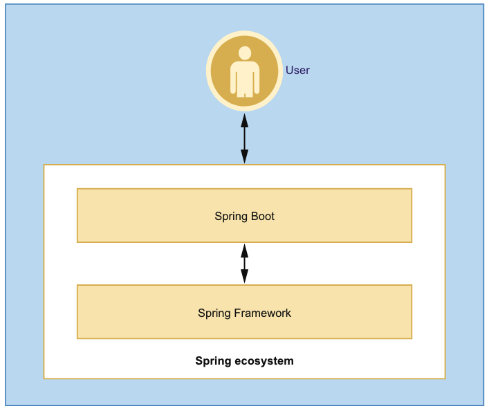
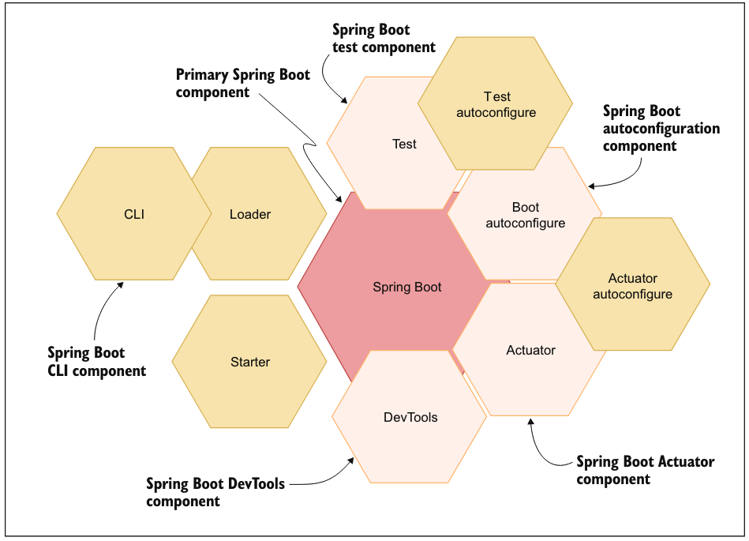
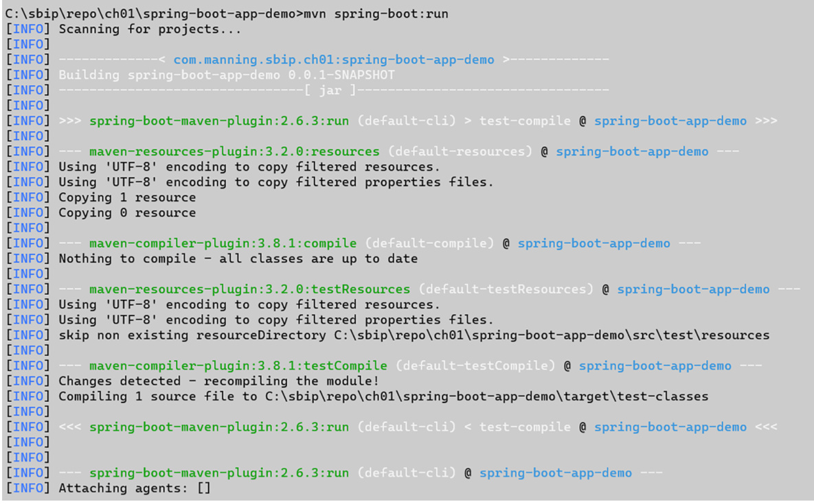

# 第1章 启动 Spring Boot

本章将介绍 Spring Boot 的核心理念、设计哲学和快速入门方法。你将了解 Spring Boot 如何简化 Spring 应用开发，以及如何创建第一个可运行的 Web 应用。

## 本章内容

- Spring Boot 简介与核心特性
- 为什么选择 Spring Boot
- Spring Boot 的约定优于配置（Convention over Configuration）
- 创建第一个 Spring Boot Web 应用
- 理解 Spring Boot 的启动流程

## 配套示例

本章配套示例位于 `samples/ch01/web-api`，演示了一个最简单的 Spring Boot Web API 应用。

运行示例：
```bash
cd samples
mvn spring-boot:run -pl ch01/web-api
```

访问 http://localhost:8080/hello 查看运行效果。

---

## 1.1 介绍 Spring Boot（Introducing Spring Boot）

在本节中，我们将向你介绍 Spring Boot 框架，并简要回答一些有关 Spring Boot 的常见问题。

我们将讨论为什么需要 Spring Boot 框架，介绍该框架本身、它所提供的各种特性，以及框架的主要组成部分。


### 1.1.1 为什么选择 Spring Boot？（Why Spring Boot?）

当我们开始这段熟悉 Spring Boot 的美好旅程时，脑海中浮现的第一个问题通常是：**我们为什么要学习它？**

要回答这个问题，让我们先了解 Spring Boot 希望解决哪些问题。

Spring Framework 的最初目标是简化 Java 企业级应用的开发。

它因简化的应用开发策略以及框架所承担的“繁重工作”而广受欢迎。

然而，随着 Spring 被越来越多地用作开发框架，进一步简化 Spring 应用开发流程的需求也随之增强。

尽管 Spring 在帮助开发者专注于业务逻辑方面提供了极大的支持，但在 Spring Boot 出现之前，开发者仍然需要完成大量使应用正常运行的工作。

例如，在开发基于 Spring 的 Web 应用时，你将面临以下一些挑战：

* 理解 Servlet 以及与之关联的部署描述符 `web.xml` 的相关概念；
* 熟悉 `WAR` 和 `EAR` 归档结构，用于打包应用组件；
* 了解应用服务器相关的概念，如域（domain）、端口（port）、线程（thread）以及数据源（data source）等；
* 处理复杂的类加载策略、应用监控、管理机制以及日志配置等问题。

这些技术概念层出不穷。

假如你只是希望编写应用的业务逻辑、生成一个可执行文件并在命令行中运行它，却仍然需要应对大量复杂的 XML 配置或其他技术细节——这显然过于繁琐。

Spring Boot 正是为了解决这些问题而诞生。

随着你在学习过程中不断深入，会发现 Spring Boot 能够轻松处理许多配置与集成问题。

例如，在 Spring Boot 项目中，你无需定义 `web.xml` 部署描述文件；

你也无需在外部应用服务器上运行应用，除非你特别希望这样做。

在大多数情况下，Spring Boot 的默认配置足以满足你的开发需求。


### 1.1.2 什么是 Spring Boot？（What is Spring Boot?）

Spring Boot 于 2014 年 4 月发布，旨在减轻 Java Web 应用开发的负担。

它让开发者能够更多地专注于业务逻辑，而不是编写模板化的技术性代码和复杂的配置。

Spring Boot 的目标是创建一个基于 Spring 的、**可直接投入生产的独立应用**，并且在尽可能少的配置修改下即可运行。

它采用了一种“主见式（opinionated）”的方式，在 Spring Framework 之上提供了额外的一层封装，使应用开发者能够更快地开始项目，并根据实际需求调整配置。

它为用户简化了某些配置任务，从而提高了开发效率。

下图展示了 Spring Boot 在开发者与 Spring Framework 之间所处的位置。

作为中间层，Spring Boot 在两者之间起到桥梁作用。

> **图 1.1**　Spring Boot 在 Spring 生态系统中的位置


### 1.1.3 Spring Boot 的核心特性（Spring Boot core features）

Spring Boot 具备若干显著特性，使其从众多框架中脱颖而出：

* **快速启动（Fast bootstrapping）**
  Spring Boot 的主要目标之一是为 Spring 应用开发提供快速启动体验。  
  例如，在传统方式下构建一个基于 Spring 的 Web 应用，你需要执行以下步骤：

  1. 使用 Maven 或 Gradle 创建带有 Spring MVC 依赖的项目；
  2. 配置 Spring MVC 的 `DispatcherServlet`；
  3. 将应用组件打包成 WAR 文件；
  4. 将 WAR 文件部署到 Servlet 容器（如 Apache Tomcat）。
     而使用 Spring Boot，只需在项目中声明依赖，Spring Boot 便会自动处理其余工作。

* **自动配置（Autoconfiguration）**
  Spring Boot 会根据 classpath 中的 JAR 文件或配置属性文件自动配置 Spring 应用的基础组件。  
  例如，如果 Spring Boot 检测到 classpath 中存在数据库驱动（如 H2 内存数据库的 JAR），它会自动配置数据源以连接该数据库。

* **主见式（Opinionated）**
  Spring Boot 采用主见式设计，自动配置一系列适合特定场景的组件。  
  它通过“起步依赖（starter dependencies）”的形式为开发者提供便捷支持。  
  每个 starter 依赖针对应用的特定功能区域提供相关依赖。  
  例如，`spring-boot-starter-web` 依赖会引入构建 Web 应用所需的所有库（如 `spring-web` 和 `spring-webmvc`）。

* **独立运行（Standalone）**
  Spring Boot 应用内嵌 Web 服务器，因此可以独立运行，而无需外部 Web 或应用服务器。  
  这使得 Spring Boot 应用能够被打包为可执行的 JAR 文件，并通过命令 `java -jar` 直接运行。  
  这种方式同时便于容器化与云原生部署。

* **生产就绪（Production-ready）**
  Spring Boot 提供多种开箱即用的生产级功能，用于监控和管理应用。  
  例如健康检查（Health Check）、线程转储（Thread Dump）及其他度量指标等。


### 1.1.4 Spring Boot 的组件（Spring Boot components）

Spring Boot 由多个组件组成，每个组件负责应用开发的特定领域。

其中一些为核心组件，在几乎所有 Spring Boot 项目中都会用到。

例如，`spring-boot` 是主要组件，几乎存在于所有项目中。

下图展示了 Spring Boot 的主要组件。

> **图 1.2**　Spring Boot 的主要组件结构


以下是主要组件的简要说明：

* **`spring-boot`**
  核心组件，为其他组件提供支持。  
  其中包含 `SpringApplication` 类，提供创建独立 Spring Boot 应用的静态方法。  
  同时支持嵌入式 Web 服务器（如 Tomcat），并支持外部化应用配置。 

* **`spring-boot-autoconfigure`**
  提供 Spring Boot 自动配置机制。  
  它会根据 classpath 中的依赖自动推测所需的 Spring Bean，并进行配置。  
  如果检测到用户自定义配置，则自动配置将优先让位。

* **`spring-boot-starters`**
  为开发者提供预打包的依赖描述符集合，用于快速集成 Spring 相关技术。  
  例如 `spring-boot-starter-web` 会自动包含所有开发 Web 应用所需的依赖。

* **`spring-boot-cli`**
  面向开发者的命令行工具，用于编译和运行 Groovy 代码，并可在文件修改时自动重启应用。  
  该工具可快速原型化 Spring 应用，而无需显式使用 Maven 或 Gradle。

* **`spring-boot-actuator`**
  提供 Actuator 端点，用于监控和管理 Spring Boot 应用。  
  Actuator 可以通过 JMX 或 HTTP 端点访问，支持内置与自定义的监控点。

* **`spring-boot-actuator-autoconfigure`**
  根据 classpath 中的依赖自动配置 Actuator 端点。  
  例如，当检测到 `Micrometer` 依赖时，会自动配置 `MetricsEndpoint`。

* **`spring-boot-test`** 与 **`spring-boot-test-autoconfigure`**
  提供 Spring Boot 应用测试相关的注解和方法。

* **`spring-boot-loader`**
  支持将 Spring Boot 应用打包为单个可执行 JAR 文件，包含所有依赖和嵌入式服务器。

* **`spring-boot-devtools`**
  提供开发阶段的便捷工具，如自动检测代码变更并热重启应用、HTML 自动刷新等，以提升开发效率。


## 1.2 代码示例（Code examples）

在本节中，我们将讨论本书中使用的代码示例及其所采用的相关技术。

我们将介绍构建系统、编程语言以及本书示例所使用的数据库。

此外，还将介绍 Lombok 库，它可以通过简单的注解帮助我们简化 POJO 类（Plain Old Java Object）的定义。

### 1.2.1 Maven 与 Gradle（Maven vs. Gradle）

Spring Boot 允许你使用 [**Apache Maven**](https://maven.apache.org/)或 [**Gradle**](https://gradle.org/) 来创建 Spring Boot 项目。

在 [**Spring Initializr** 工具](https://start.spring.io/) 中，你可以选择任意一种构建系统生成项目。

在本书中，我们将使用 **Apache Maven** 作为首选构建工具，因为大多数读者对 Maven 更加熟悉。

然而，如果你偏好使用 Gradle，也可以轻松地将书中的代码示例迁移到 Gradle 环境中。


### 1.2.2 Java 与 Kotlin（Java vs. Kotlin）

你可以在 Spring Boot 项目中使用 **Java** 或 [**Kotlin**](https://kotlinlang.org/) 作为编程语言。

自 Spring Framework 5.0 起，框架已正式加入对 Kotlin 的支持，并且此后一直在不断增强 Kotlin 的兼容性。

例如，在 **Spring Security 5.3** 中，Spring 团队引入了面向 Kotlin 的 DSL（领域特定语言）版本，以便更好地在 Kotlin 环境中使用 Spring Security。

你可以通过以下链接了解更多有关 Spring 对 [Kotlin](http://mng.bz/Bxw8) 的支持信息。

在本书中，我们主要使用 **Java** 作为代码示例的编程语言。

不过，在第 10 章中，我们将介绍 Spring Framework（通过 Spring Boot）中主要的 Kotlin 特性。

### 1.2.3 数据库支持（Database support）

本书中的若干示例需要使用数据库来演示相关概念。

Spring Boot 支持多种 SQL 与 NoSQL 数据库。

为便于演示与测试，本书将主要使用 **H2 内存数据库（H2 in-memory SQL database）**。

除个别例外情况外，所有示例均会采用此数据库环境。

### 1.2.4 Lombok

[**Lombok**](https://projectlombok.org/) 是一个 Java 库，可通过注解自动生成构造函数、getter、setter、`toString()` 等方法。

开发者只需在普通的 Java POJO 类中添加相应注解即可。

例如，为所有成员变量生成 getter 方法，只需添加 `@Getter` 注解即可。

在本书的代码示例中，我们将广泛使用 Lombok 来简化类定义。

如果你不想使用 Lombok，也可以手动编写 getter、setter 和构造函数。

无论是否使用 Lombok，本书中的代码示例都可以正常运行。


::: tip

**记录类型（Record）**

**Java 14** 引入了新的语言特性——**record（记录类）**。
Record 是一种不可变的数据类（immutable data class），
它只需声明字段的类型与名称，Java 编译器便会自动生成 `equals()`、`hashCode()` 和 `toString()` 方法，
同时生成私有的 `final` 字段、对应的 getter 方法以及公共构造函数。

如果你不希望使用像 Lombok 这样的第三方库，可以考虑使用原生的 Java record。

Record 定义示例如下：

```java
public record Course(int id, String name, String description, int rating) {}
```

编译器会自动为每个定义的字段生成构造函数和 getter 方法（如 `id()`, `name()` 等），
同时生成 `equals()` 与 `hashCode()` 方法。

你可以通过以下链接了解更多关于 [Java record](http://mng.bz/donO) 的信息。

:::

## 1.3 开始使用 Spring Boot（Getting started with Spring Boot）

至此，你已经对 Spring Boot 有了整体了解，并明白了该框架的主要用途。

在本节中，你将学习如何生成一个 Spring Boot 项目，并了解其自动生成项目的各个组成部分。


### 1.3.1 你的第一个 Spring Boot 项目（Your first Spring Boot project）

Spring Boot 提供了一个名为 **Spring Initializr** 的工具，用于生成 Spring Boot 项目的骨架结构。

你可以通过以下地址访问该工具：[https://start.spring.io](https://start.spring.io)

此外，Spring Boot 还提供了相关 API，主流的 IDE（如 IntelliJ IDEA、Eclipse 等）也已集成该工具，支持在 IDE 内直接生成 Spring Boot 项目。

如果你是第一次使用 Spring Initializr，可参考本书附录 A，其中介绍了创建 Spring Boot 项目的多种方式。

为方便你参考，我们在本书的配套 GitHub 仓库中生成了一个 Spring Boot 示例项目，可通过以下链接查看：[http://mng.bz/razD](http://mng.bz/razD)


### 1.3.2 Spring Boot 项目结构（Spring Boot project structure）

生成的 Spring Boot 项目结构相对简单，仅包含继续开发所需的基本组件。

主要包括以下内容：

* **`pom.xml` 文件**：包含在项目生成时所选择的依赖项。
* **Maven 包装器文件（Maven wrapper）**：允许你在未安装 Maven 的本地环境中构建项目。
* **包结构**：包含源代码与测试代码目录。

  * 源代码包中包含带有 `main()` 方法的主类。
  * 测试包中包含一个空的测试类。
* **资源文件夹（resources）**：包含用于维护项目资源的文件，以及一个空的 `application.properties` 配置文件。


下面，我们将详细讨论这些自动生成文件的关键组成部分。

### Maven pom.xml 文件（The Maven pom.xml file）

生成的 Spring Boot 项目的 `pom.xml` 文件如下所示。

> **代码清单 1.1**　生成的 Spring Boot 项目的 pom.xml 文件

```xml
<?xml version="1.0" encoding="UTF-8"?>
<project xmlns="http://maven.apache.org/POM/4.0.0"
         xmlns:xsi="http://www.w3.org/2001/XMLSchema-instance"
         xsi:schemaLocation="http://maven.apache.org/POM/4.0.0 
                             https://maven.apache.org/xsd/maven-4.0.0.xsd">
    <modelVersion>4.0.0</modelVersion>

    <!-- 
        Parent: Spring Boot 的父级项目
        通过继承 spring-boot-starter-parent，可以直接获得默认的依赖管理、
        插件管理以及通用配置（如 Java 版本、编译插件、测试插件等）。
    -->
    <parent>
        <groupId>org.springframework.boot</groupId>
        <artifactId>spring-boot-starter-parent</artifactId>
        <version>2.6.3</version>
        <relativePath/> <!-- 从远程仓库查找父项目 -->
    </parent>

    <!-- 
        当前项目的基本信息：
        groupId: 通常是包名前缀（公司或组织域名的反写）
        artifactId: 模块/项目名称
        version: 当前项目版本号
    -->
    <groupId>com.manning.sbip.ch01</groupId>
    <artifactId>spring-boot-app-demo</artifactId>
    <version>1.0.0</version>
    <name>spring-boot-app-demo</name>
    <description>Spring Boot Demo Application</description>

    <!-- 指定 Java 编译版本 -->
    <properties>
        <java.version>17</java.version>
    </properties>

    <!-- =============================
         项目依赖 (Dependencies)
         ============================= -->
    <dependencies>

        <!-- 
            Spring Boot Web 起步依赖 (starter)
            提供构建 Web 应用所需的所有依赖：
            Spring MVC、Tomcat、Jackson 等。
        -->
        <dependency>
            <groupId>org.springframework.boot</groupId>
            <artifactId>spring-boot-starter-web</artifactId>
        </dependency>

        <!-- 
            Spring Boot 测试起步依赖
            集成了常用测试框架，如 JUnit5、Mockito、Hamcrest 等。
            默认排除了旧版的 JUnit4 Vintage 引擎。
        -->
        <dependency>
            <groupId>org.springframework.boot</groupId>
            <artifactId>spring-boot-starter-test</artifactId>
            <scope>test</scope>
            <exclusions>
                <exclusion>
                    <groupId>org.junit.vintage</groupId>
                    <artifactId>junit-vintage-engine</artifactId>
                </exclusion>
            </exclusions>
        </dependency>

    </dependencies>

    <!-- =============================
         构建配置 (Build)
         ============================= -->
    <build>
        <plugins>

            <!-- 
                Spring Boot Maven 插件：
                提供了构建与运行 Spring Boot 应用的便捷命令。
                例如：
                  mvn spring-boot:run       运行应用
                  mvn package               打包为可执行 JAR
            -->
            <plugin>
                <groupId>org.springframework.boot</groupId>
                <artifactId>spring-boot-maven-plugin</artifactId>
            </plugin>

        </plugins>
    </build>

</project>
```


该 `pom.xml` 文件可以分为以下三个主要部分：

1. **父项目标签（Parent tag）**
2. **依赖声明部分（Dependencies section）**
3. **Spring Boot Maven 插件（Spring Boot Maven plugin）**


#### 父项目标签（Parent tag）

`spring-boot-starter-parent` 是所有 Spring Boot 起步依赖（starter dependencies）的父级项目。

它表明当前项目是一个 Spring Boot 子项目，并继承父项目的部分配置。

该父项目提供多种默认配置，例如：

* 默认 Java 版本；
* 为 Maven 插件（如 `maven-war-plugin`、`maven-surefire-plugin`）提供预设配置。

此外，`spring-boot-starter-parent` 还负责依赖管理。

你会注意到在依赖声明中没有显式定义版本号——这是因为 Spring Boot 会通过父项目自动确定各依赖的合适版本。

如果你的项目已经有自定义的父 `pom.xml`，仍可以通过在 `dependencyManagement` 部分引入以下配置，来享受 Spring Boot 的依赖管理机制：

```xml
<dependencyManagement>
    <dependencies>
        <dependency>
            <groupId>org.springframework.boot</groupId>
            <artifactId>spring-boot-dependencies</artifactId>
            <version>2.6.3</version>
            <type>pom</type>
            <scope>import</scope>
        </dependency>
    </dependencies>
</dependencyManagement>
```


#### 依赖声明部分（Dependencies section）

`pom.xml` 文件的第二部分声明了项目所需的起步依赖。

Spring Boot 的 “起步依赖（starter dependency）” 是该框架的一大特性。

它将常用依赖打包为统一集合，以简化依赖管理。

例如：

* `spring-boot-starter-web`：包含构建 Web 应用所需的全部依赖（包括 Spring MVC、Tomcat 等）；
* `spring-boot-starter-test`：包含编写和运行测试所需的依赖（JUnit 5、Hamcrest、Mockito 等）。
  此外，它还排除了旧版 JUnit 引擎（`junit-vintage-engine`），以使用新版的 JUnit Jupiter 引擎。


#### Spring Boot Maven 插件（Spring Boot Maven plugin）

`spring-boot-maven-plugin` 插件为开发者提供了多种应用管理功能。

例如，它可以方便地构建可执行的 JAR 或 WAR 文件。

该插件通过 “repackage” 任务将 Maven 生成的普通 JAR/WAR 文件重新打包为可执行文件。

下表列出了该插件的常用命令及说明。

> **表 1.1**　Spring Boot Maven 插件常用命令

| 功能                | Maven 命令语法                | 描述                                                              |
| ----------------- | ------------------------- | --------------------------------------------------------------- |
| 构建镜像              | `spring-boot:build-image` | 将应用打包为 OCI 容器镜像（详见第 9 章）。                                       |
| 生成构建信息            | `spring-boot:build-info`  | 根据当前 Maven 项目生成 `build-info.properties` 文件。                     |
| 显示帮助信息            | `spring-boot:help`        | 显示插件帮助内容。例如：<br>`mvn spring-boot:help -Dgoal=run -Ddetail=true` |
| 重新打包可执行文件         | `spring-boot:repackage`   | 将生成的 JAR/WAR 文件重新打包为可执行文件，可使用 `java -jar` 运行。                   |
| 运行 Spring Boot 应用 | `spring-boot:run`         | 在命令行直接运行 Spring Boot 应用。                                        |
| 启动应用              | `spring-boot:start`       | 启动 Spring Boot 应用。                                              |
| 停止正在运行的应用         | `spring-boot:stop`        | 停止通过 `start` 命令启动的应用。                                           |


### 运行 Spring Boot 应用（Running the application）

你可以在包含 `pom.xml` 的目录中执行以下命令运行 Spring Boot 应用：

```bash
mvn spring-boot:run
```

运行后，应用将在默认的 HTTP 端口 **8080** 上启动。

> **图 1.3**　使用 Spring Boot Maven 插件运行 Spring Boot 应用的控制台输出


从命令行输出可以看到，该命令会调用多个其他 Maven 插件，例如：

* `maven-resources-plugin`：用于复制资源文件；
* `maven-compiler-plugin`：用于编译源代码。

`spring-boot-maven-plugin` 对这些底层任务进行了封装，
使开发者无需显式配置即可直接运行应用。


### Spring Boot 主类（The Spring Boot main class）

在生成的项目中，Spring Initializr 自动创建了一个包含 `main()` 方法的 Java 类，如下所示。

> **代码清单 1.2**　Spring Boot 主类定义

```java
package com.manning.sbip.ch01;

import org.springframework.boot.SpringApplication;
import org.springframework.boot.autoconfigure.SpringBootApplication;

@SpringBootApplication
public class SpringBootAppDemoApplication {
    public static void main(String[] args) {
        SpringApplication.run(SpringBootAppDemoApplication.class, args);
    }
}
```


该生成的 Java 文件包含以下关键组成部分：

1. 使用 `main()` 方法；
2. 使用 `@SpringBootApplication` 注解；
3. `SpringApplication` 类的作用。

通常，在传统 Web 应用中，你需要将应用组件打包为 WAR 文件并部署至 Servlet 容器（如 Tomcat、JBoss 等）。

而在 Spring Boot 中，这一过程被大大简化。

通过在类中定义 `main()` 方法，Spring Boot 会自动启动一个嵌入式 Tomcat 实例来运行 Web 应用。


#### `@SpringBootApplication` 注解详解

`@SpringBootApplication` 是一个复合注解，
由以下三个注解组成：

* **`@EnableAutoConfiguration`**
  启用 Spring Boot 的自动配置功能，根据 classpath 中的依赖自动配置应用所需的 Bean。

* **`@ComponentScan`**
  扫描根包及其子包下的所有组件类（带有 `@Component`、`@Service`、`@Repository`、`@Bean` 等注解的类）。

* **`@SpringBootConfiguration`**
  指示该类为 Spring Boot 配置类，其本身带有 `@Configuration` 元注解，
  可让 Spring Boot 自动加载其中定义的 Bean。

> 请注意，主类应位于应用的根包中。
> `@SpringBootApplication` 会以主类所在包为基础，
> 自动扫描该包及其所有子包下的组件。
> 如果主类不在根包中，其它包内的组件将无法被扫描到。

更多详细信息可参考以下链接：
[http://mng.bz/xv8e](http://mng.bz/xv8e)

### SpringApplication 类的作用（The role of SpringApplication class）

`SpringApplication` 类用于引导（bootstrap）并启动整个 Spring Boot 应用。

在执行 `run()` 方法时，它会完成以下步骤：

1. 根据 classpath 中的依赖创建 `ApplicationContext` 实例；
2. 注册 `CommandLinePropertySource`，以将命令行参数作为 Spring 属性暴露；
3. 刷新 `ApplicationContext`，加载所有单例 Bean；
4. 触发应用中配置的 `ApplicationRunner` 和 `CommandLineRunner`。

::: tip

**回顾 ApplicationContext（Revisiting ApplicationContext）**

大多数 Java 应用都由多个对象组成，这些对象相互依赖。

为了有效管理对象的创建与依赖关系，Spring 引入了 **依赖注入（Dependency Injection, DI）** 与 **控制反转（Inversion of Control, IoC）** 的概念。

Spring 通过 **ApplicationContext 接口** 充当 IoC 容器，负责管理 Bean 的生命周期与依赖注入。

Bean 定义可以通过 XML 文件（如 `applicationContext.xml`）或注解配置（如 `@Configuration`）的方式声明。

Spring 根据应用类型（Servlet 或 Reactive）及配置方式（classpath 或注解）提供多种 `ApplicationContext` 实现。

你可以在以下链接中了解更多相关内容：[http://mng.bz/AxJK](http://mng.bz/AxJK)

:::

### SpringApplication 的类型选择（Customizing SpringApplication to select the application type）

`SpringApplication` 类会根据 classpath 中的 JAR 依赖尝试创建合适的 `ApplicationContext` 实例。

一个 Spring Boot 应用可以是 **基于 Servlet** 或 **基于响应式（Reactive）** 的应用。

Spring Boot 通过分析 classpath 中的依赖类来判断当前应用的类型。

确定类型后，Spring Boot 会应用以下策略加载应用上下文：

1. 如果应用被识别为基于 Servlet 的 Web 应用，
   Spring Boot 将创建 `AnnotationConfigServletWebServerApplicationContext` 实例；
2. 如果应用是响应式类型，
   Spring Boot 将创建 `AnnotationConfigReactiveWebServerApplicationContext` 实例；
3. 如果既不是 Servlet 应用，也不是响应式应用，
   Spring Boot 则会创建 `AnnotationConfigApplicationContext` 实例。

通常，我们通过 `SpringApplication.run()` 方法启动 Spring Boot 应用。

不过，Spring Boot 还允许我们显式创建 `SpringApplication` 实例，以自定义启动行为。

例如，如果你已知应用类型，可以直接在 `SpringApplication` 实例中设置，示例如下。

> **代码清单 1.3**　自定义 SpringApplication 实例，将应用类型设为响应式（Reactive）

```java
package com.manning.sbip.ch01;

// 导入相关 Spring Boot 包（此处省略）
@SpringBootApplication
public class BootstrappingSpringBootAppApplication {

    public static void main(String[] args) {

        // 创建一个 SpringApplication 实例，
        // 参数为当前主启动类（BootstrappingSpringBootAppApplication.class）
        SpringApplication springApplication =
                new SpringApplication(BootstrappingSpringBootAppApplication.class);

        // 设置应用类型为 REACTIVE（响应式应用）
        // 可选值包括：
        // - WebApplicationType.SERVLET：传统 Servlet 应用（默认）
        // - WebApplicationType.REACTIVE：响应式应用（如使用 WebFlux）
        // - WebApplicationType.NONE：非 Web 应用
        springApplication.setWebApplicationType(WebApplicationType.REACTIVE);

        // 运行应用（相当于 SpringApplication.run(...)）
        springApplication.run(args);
    }
}
```


`SpringApplication` 还提供了多种 setter 方法，可用于控制不同的 Spring Boot 特性，例如设置额外的 Spring Profile，或指定资源加载器以加载应用资源等。

关于 `SpringApplication` 的更多内容，可参考 [Spring Boot 官方文档](http://mng.bz/ZzJO)


### 使用 application.properties 文件管理配置（Configuration management with the application.properties file）

Spring Initializr 会在 `src/main/resources` 目录下生成一个空的 `application.properties` 文件。

该文件允许你以外部化方式配置应用属性（例如服务器详情、数据库信息等）。

虽然 Spring Boot 支持多种配置方式，但使用 `application.properties` 文件是最常见的方法。

在该文件中，配置项以 `key=value` 的形式定义。

下面的示例展示了如何在 `application.properties` 文件中设置服务器地址与端口号。

> **代码清单 1.4**　配置服务器地址与端口的 application.properties 示例

```properties
# ---------------------------
# Listing 1.4
# application.properties 文件内容
# 用于配置 Spring Boot 应用的网络地址和端口
# ---------------------------

# 指定服务器绑定的网络地址
# 通常为 localhost（仅在本机访问）
server.address=localhost

# 指定服务器 HTTP 端口号
# 默认是 8080，这里显式设置为 8081
server.port=8081

# 指定要通过 HTTP 暴露的所有 Actuator 端点
# “*” 表示暴露全部端点（仅建议在本地开发或调试时使用）
management.endpoints.web.exposure.include=*
```

若要验证此配置，你可以修改 `server.port` 的值，例如改为 `9090`，然后重新启动应用，即可看到服务运行在新的端口上。

如果你更倾向于使用 YAML 格式进行配置，可以参考 [https://yaml.org/spec/1.2/spec.html](https://yaml.org/spec/1.2/spec.html)。

YAML 支持层级结构的配置方式。

要使用 YAML 格式，只需将 `application.properties` 重命名为 `application.yml`，并按以下格式编写配置：

> **代码清单 1.5**　等价的 application.yml 配置示例

```yaml
server:
  address: localhost
  port: 8080
management:
  endpoints:
    web:
      exposure:
        include: '*'
```

更多可用的 `application.properties` 配置项可参考：[http://mng.bz/REJ0](http://mng.bz/REJ0)


### 创建可执行的 JAR 文件（Creating an executable JAR file）

生成 Spring Boot 项目后，最简单的方式是使用以下命令创建可执行 JAR 文件：

```bash
mvn package
```

根据生成时的选择，Maven 会在 `target` 目录中创建 JAR 文件。

可执行 JAR 文件可通过以下命令运行：

```bash
java -jar spring-boot-app-demo.jar
```

默认情况下，Maven 的 `package` 目标不会生成可执行文件。

Spring Boot 的 `spring-boot-maven-plugin` 插件在打包阶段会自动调用 `repackage` 目标，将普通 JAR 重新打包为可执行 JAR。


### 探索 JAR 文件结构（Exploring the JAR file）

当你打开生成的 JAR 文件时，将看到类似如下的结构。

> **代码清单 1.6**　Spring Boot 生成的 JAR 文件结构

```
spring-boot-app-demo.jar
|
+-META-INF
|   +-MANIFEST.MF
|
+-org
|   +-springframework
|       +-boot
|           +-loader
|               +-<spring boot loader classes>
|
+-BOOT-INF
|   +-classes
|   |   +-com
|   |       +-manning
|   |           +-sbip
|   |               +-ch01
|   |                   +-SpringBootAppDemoApplication.class
|   +-lib
|       +-dependency1.jar
|       +-dependency2.jar
|   +-classpath.idx
|   +-layers.idx
```

整个结构可分为四个主要部分：

* **META-INF**
  包含 `MANIFEST.MF` 文件，其中记录了 JAR 运行所需的重要元信息，关键参数包括 `Main-Class` 和 `Start-Class`。

* **Spring Boot 加载器组件（Spring Boot loader components）**
  Spring Boot 提供多种类加载器实现，用于加载可执行文件。
  例如：

  * `JarLauncher` 用于加载 JAR 文件；
  * `WarLauncher` 用于加载 WAR 文件；
  * `PropertiesLauncher` 可通过配置属性（`loader.*`）自定义加载行为。

* **BOOT-INF/classes**
  存放应用的编译后类文件。

* **BOOT-INF/lib**
  存放应用所依赖的所有外部库文件。

其中 `classpath.idx` 文件用于列出类加载器的加载顺序；

`layers.idx` 文件用于将 JAR 分层，便于 Docker 或 OCI 镜像构建。

你将在第 9 章学习如何在创建 Docker 镜像时使用 `layer.idx`。


### 关闭 Spring Boot 应用（Shutting down a Spring Boot application）

关闭 Spring Boot 应用的方式相对简单。

如果以前台进程运行 JAR 文件，可直接在命令行使用 **Ctrl + C**（Windows 或 Linux）终止进程。

如果应用在后台运行，可使用操作系统命令终止对应的 Java 进程。

然而，上述方式会导致应用立即终止，无法保证当前正在执行的请求得到妥善处理。

为了避免中断用户请求，我们应当配置 **优雅关闭（graceful shutdown）**，使系统能在关闭前完成正在执行的任务。

以下是配置示例：

> **代码清单 1.7**　优雅关闭（graceful shutdown）配置

```properties
server.shutdown=graceful
spring.lifecycle.timeout-per-shutdown-phase=1m
```

`server.shutdown` 属性默认值为 `immediate`，即应用立即终止。

配置为 `graceful` 后，Spring Boot 会等待当前请求处理完毕再关闭。

`spring.lifecycle.timeout-per-shutdown-phase` 的默认值为 `30s`，你可以根据需要自定义超时时间。

上例中设置为 `1m`（1 分钟）。

> **注意（Note）**
> 优雅关闭功能自 Spring Boot **2.3.0** 版本引入，
> 早期版本不支持该配置。


## 小结

（待补充：本章要点总结）
