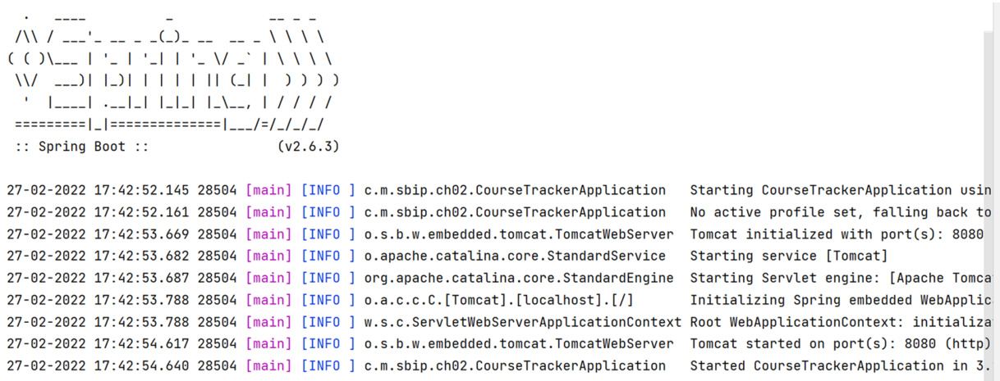
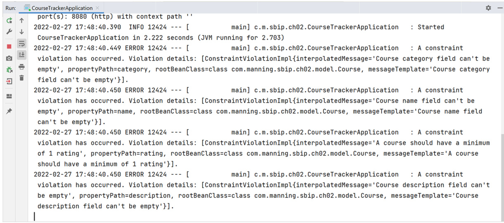

# 第 2 章 — 常见的 Spring Boot 任务（Common Spring Boot Tasks）

## 本章内容（This chapter covers）

- 在 Spring Boot 应用中管理配置  
- 使用 `@ConfigurationProperties` 创建自定义配置  
- 探索 `CommandLineRunner` 接口以执行初始化代码  
- 理解 Spring Boot 默认日志机制并配置 `Log4j2` 日志  
- 在 Spring Boot 应用中使用 Bean Validation 验证用户数据  

到目前为止，我们已经了解了 Spring Boot 的基本概念，以及它通过抽象底层细节来改善应用开发体验的目的。

在本章中，你将进一步加深对这些概念的理解，学习若干关键内容，包括如何管理应用配置以及为应用创建自定义配置。同时，你还将学习使用 Spring Boot 完成一些常见的开发任务——这些任务在构建 Spring Boot 应用时会经常遇到。

## 2.1 管理配置（Managing Configurations）

应用配置管理是任何应用程序的重要组成部分，Spring Boot 应用也不例外。  
根据你的开发与部署方式，你的应用可能需要在多个环境中运行（例如：`dev`、`test`、`staging`、`prod`）。  
在一个组织中，你可能会有多个运行环境：一个用于开发、一个用于测试、一个用于预发布、一个用于生产。  

在这些不同环境下，应用的核心代码通常保持一致，但配置却需要根据环境进行调整。  
例如，数据库配置或安全配置在不同环境中会有所不同。  
随着应用的功能越来越多、依赖越来越复杂，管理配置的难度也会随之上升。

Spring Boot 提供了多种方法，允许你在不修改源码的前提下实现 **外部化配置**。  
这些方法包括使用属性文件（`property files`）、`YAML` 文件、环境变量以及命令行参数等。  

在接下来的小节中，我们将详细介绍这些方式，并演示如何在 Spring Boot 应用中管理配置。  
如果你希望参考完整代码，可以从 GitHub 仓库下载示例项目。

### 2.1.1 使用 SpringApplication 类（Using the SpringApplication Class）

> 💡 **源码位置**  
> 本节示例项目可以[点击这里](https://github.com/honkinglin/spring-boot-in-practice/tree/main/ch02/spring-application)查看  

你可以使用 Spring Boot 提供的 `SpringApplication` 类在应用中定义配置。  
该类提供了一个名为 `setDefaultProperties()` 的方法，接收一个 `java.util.Properties` 或 `java.util.Map<String, Object>` 实例，用于设置应用属性。  

这种方式适合定义一些**一次性配置**，例如你不希望每次都改动的固定参数。

例如，你可以在 `application.properties` 文件中通过 `spring.config.import` 属性导入额外的配置文件：  

```properties
spring.config.import=classpath:additional-application.properties
```

Spring Boot 会从指定路径加载额外的配置文件。  
如果文件不存在，Spring Boot 会抛出 `ConfigDataLocationNotFoundException`。  
不过，你也可以配置 `spring.config.on-not-found` 属性来指定当文件不存在时的行为，例如：

```java
package com.manning.sbip.ch02;

import java.util.Properties;
import org.springframework.boot.SpringApplication;
import org.springframework.boot.autoconfigure.SpringBootApplication;

@SpringBootApplication
public class SpringBootAppDemoApplication {

    public static void main(String[] args) {
        Properties properties = new Properties();
        properties.setProperty("spring.config.on-not-found", "ignore");

        SpringApplication application =
                new SpringApplication(SpringBootAppDemoApplication.class);
        application.setDefaultProperties(properties);
        application.run(args);
    }
}
```

如上所示，我们通过 `SpringApplication` 实例调用 `setDefaultProperties()`，并在其中设置了 `spring.config.on-not-found=ignore`。  
这使得当配置文件不存在时，应用不会中断启动过程。

### 2.1.2 使用 @PropertySource 注解（Using @PropertySource）

> 💡 **源码位置**
> 本节示例项目可以[点击这里](https://github.com/honkinglin/spring-boot-in-practice/tree/main/ch02/property-sources)查看

在 Spring 的配置类中，可以使用 `@PropertySource` 注解加载指定路径下的属性文件。  
以下示例展示了如何定义一个配置类来加载数据库配置文件：

```java
package com.manning.sbip.ch02;

import org.springframework.beans.factory.annotation.Autowired;
import org.springframework.context.annotation.Configuration;
import org.springframework.context.annotation.PropertySource;
import org.springframework.core.env.Environment;

@Configuration
@PropertySource("classpath:dbConfig.properties")
public class DbConfiguration {

    @Autowired
    private Environment env;

    @Override
    public String toString() {
        return "Username: " + env.getProperty("user")
                + ", Password: " + env.getProperty("password");
    }
}
```

上面的代码定义了一个 Spring 配置类，并通过 `@PropertySource` 注解加载了 `dbConfig.properties` 文件中的属性。  
文件内容如下：

```properties
# Listing 2.3 dbConfig.properties
user=sa
password=p@ssw0rd
```

在应用主类中，我们可以获取并打印这些配置属性：

```java
package com.manning.sbip.ch02;

import org.slf4j.Logger;
import org.slf4j.LoggerFactory;
import org.springframework.boot.SpringApplication;
import org.springframework.boot.autoconfigure.SpringBootApplication;
import org.springframework.context.ConfigurableApplicationContext;

@SpringBootApplication
public class SpringBootAppDemoApplication {

    private static final Logger log =
            LoggerFactory.getLogger(SpringBootAppDemoApplication.class);

    public static void main(String[] args) {
        ConfigurableApplicationContext context =
                SpringApplication.run(SpringBootAppDemoApplication.class, args);

        DbConfiguration dbConfig = context.getBean(DbConfiguration.class);
        log.info(dbConfig.toString());
    }
}
```

运行应用后，控制台会输出从配置文件中读取到的用户名和密码。

::: tip

**关于 @PropertySource 的补充说明**

* `@PropertySource` 注解**不支持 YAML (`.yml` 或 `.yaml`) 文件**。
  如果希望使用 YAML 文件，需要额外编写代码实现加载逻辑。

* 在 **Java 8 及以上版本**，你可以重复使用多个 `@PropertySource` 注解，以加载多个配置文件，例如：

```java
@Configuration
@PropertySource("classpath:dbConfig.properties")
@PropertySource("classpath:redisConfig.properties")
public class DbConfiguration {
    // ...
}
```

此配置会同时加载 `dbConfig.properties` 与 `redisConfig.properties` 文件中的属性。

:::

### 2.1.3 配置数据文件（Config Data File）

> 💡 **源码地址**  
> 本节对应示例项目可以[点击这里](https://github.com/honkinglin/spring-boot-in-practice/tree/main/ch02/config-data-file)查看：  

Spring Boot 允许你在 `application.properties` 或 `application.yml` 文件中定义应用程序配置属性。    
这是 Spring Boot 应用中最常见、最推荐的配置方式。  

默认情况下，Spring Initializr 生成的 Spring Boot 项目会包含一个空的 `application.properties` 文件。  
如果你更喜欢使用 YAML 格式，也可以在项目中创建 `application.yml` 文件来替代。  
无论是 `.properties` 还是 `.yml` 文件，Spring Boot 都会将其中的配置加载到 `Environment` 实例中，  
并可以在应用中通过 `@Value` 注解直接引用这些配置。

::: tip

**Properties 或 YAML 文件示例**

Spring Boot 支持使用 `.properties` 或 `.yml` 文件进行配置。  
`.properties` 文件采用键值对形式，通过 `=` 分隔键和值，例如：

```properties
server.port=8081
spring.datasource.username=sa
spring.datasource.password=password
```

上述配置在 `.yml` 文件中的等价形式如下：

```yaml
server:
  port: 8081
spring:
  datasource:
    user: sa
    password: password
```

无论选择哪种格式，Spring Boot 都能正确识别（除少数语法差异外）。  
部分开发者更偏好使用 YAML，因为它支持层级结构、语法更简洁，并且能方便表示列表或映射等复杂数据结构。

不过，如果你选择 YAML 文件，需要特别注意 **缩进与空格**，一个额外的空格或错误的缩进都会导致解析失败。  
相对而言，`.properties` 文件更易于按名称快速定位属性。

:::


#### 自定义配置文件名

如果你希望使用不同于 `application.properties`（或 `.yml`）的配置文件名，可以通过 `spring.config.name` 属性轻松实现。

假设我们在 `src/main/resources` 目录下新建一个名为 `sbip.yml` 的文件，其中包含以下配置：

```yaml
server:
  port: 8081
```

你可以使用 Maven 构建项目：

```bash
mvn package
```

生成的可执行 JAR 文件中包含了应用组件。构建完成后，可通过以下命令运行：

```bash
java -jar config-data-file-0.0.1-SNAPSHOT.jar
```

> 默认情况下，Spring Boot 使用端口 `8080` 启动。
> 若要使用自定义配置文件启动（如 `sbip.yml`），可以执行以下命令：

```bash
java -jar config-data-file-0.0.1-SNAPSHOT.jar --spring.config.name=sbip
```

此时，Spring Boot 会读取 `sbip.yml` 文件，并在端口 `8081` 启动应用。


#### 配置文件的默认加载位置

Spring Boot 默认会在以下位置查找 `application.properties` 或 `application.yml` 文件：

1. 类路径根目录（`classpath root`）
2. 类路径下的 `/config` 目录
3. 当前工作目录（`current directory`）
4. 当前目录下的 `/config` 子目录
5. `/config` 目录的子目录

此外，你还可以通过 `spring.config.location` 属性显式指定配置文件路径，例如：

```bash
java -jar target/config-data-file-0.0.1-SNAPSHOT.jar \
  --spring.config.location=C:\sbip\repo\ch02\config-data-file\data\sbip.yml
```

> 上述命令会在 HTTP 端口 `8081` 启动应用，并从指定路径加载配置文件。


#### 可选配置文件（Optional Configuration）

从 Spring Boot **2.4.0** 开始，如果无法找到指定的配置文件，程序会抛出错误。
若希望文件是“可选”的，可在路径前添加 `optional:` 前缀：

```bash
java -jar target/config-data-file-0.0.1-SNAPSHOT.jar \
  --spring.config.location=optional:C:\sbip\repo\ch02\config-data-file\data\sbip1.yml
```

这样即使文件不存在，应用仍然可以正常启动。

::: tip

**关于 spring.config.name 与 spring.config.location**

Spring Boot 在**应用启动的早期阶段**就会加载 `spring.config.name` 和 `spring.config.location`，
因此这两个配置不能放在 `application.properties` 或 `application.yml` 中。

若需要设置它们，可以使用以下方式：

* 通过 `SpringApplication.setDefaultProperties()` 方法；
* 通过系统环境变量；
* 通过命令行参数。

:::

::: tip

**命令行参数（Command Line Arguments）**

Spring Boot 支持通过命令行传入配置参数。
例如，我们在执行 JAR 文件时可以这样指定：

```bash
java -jar config-data-file-0.0.1-SNAPSHOT.jar \
  --spring.config.name=sbip \
  --spring.config.location=file:data/sbip.yml
```

这与前面介绍的方式效果相同，只是配置以命令行参数形式传递。

:::

#### 基于 Profile 的配置文件（Profiles for Configuration）

Spring Boot 允许你为不同的运行环境定义独立的配置文件。
例如：

* `application-dev.properties`（开发环境）
* `application-test.properties`（测试环境）
* `application-prod.properties`（生产环境）

你可以在主配置文件中通过属性 `spring.profiles.active` 激活特定 Profile：

```properties
spring.profiles.active=dev
```

当激活 `dev` 时，应用会自动加载 `application-dev.properties` 文件。  
如果切换为 `test`，则会加载 `application-test.properties` 文件。

示例：

```properties
# application-dev.properties
server.port=9090

# application-test.properties
server.port=9091
```

#### 配置文件的加载顺序

Spring Boot 加载配置文件的顺序如下：

1. 打包在应用 JAR 内的默认 `application.properties` 或 `.yml` 文件
2. 打包在应用 JAR 内的 Profile 专属配置文件（如 `application-dev.properties`）
3. 位于 JAR 外部的默认配置文件
4. 位于 JAR 外部的 Profile 专属配置文件

这种分层加载机制使得配置既可以内置于应用中，又能根据部署环境灵活覆盖。

### 2.1.4 操作系统环境变量（OS Environment Variable）

> 💡 **源码地址**  
> 本节对应示例项目可以[点击这里](https://github.com/honkinglin/spring-boot-in-practice/tree/main/ch02/os-env-variables)查看：  

你可以将应用配置声明为系统环境变量，并在配置文件中通过变量名引用它。  
下面我们通过一个示例来演示如何实现这一点。  

假设在 `application.properties` 文件中定义了一个自定义属性 `app.timeout`，内容如下：

```properties
app.timeout=${APP_TIMEOUT}
```

这里的 `APP_TIMEOUT` 是一个操作系统环境变量，我们将在操作系统中为它赋值。  
在 Windows 中，你可以通过以下命令设置环境变量：

```bash
set APP_TIMEOUT=30
```

在 Linux 或 macOS 终端中，你可以使用：

```bash
export APP_TIMEOUT=30
```

需要注意的是，通过这种方式设置的环境变量**只在当前命令行会话中有效**。  
因此，运行 Spring Boot 应用时应在同一终端窗口执行。

#### 在应用中访问环境变量（Accessing Environment Variables）

我们可以在应用代码中读取该环境变量。  
下面的示例展示了如何访问 `app.timeout` 属性并输出其值：

```java
package com.manning.sbip.ch02;

// imports
import org.slf4j.Logger;
import org.slf4j.LoggerFactory;
import org.springframework.boot.SpringApplication;
import org.springframework.boot.autoconfigure.SpringBootApplication;
import org.springframework.context.ConfigurableApplicationContext;
import org.springframework.core.env.Environment;

@SpringBootApplication
public class SpringBootAppDemoApplication {

    private static final Logger log =
            LoggerFactory.getLogger(SpringBootAppDemoApplication.class);

    public static void main(String[] args) {
        ConfigurableApplicationContext context =
                SpringApplication.run(SpringBootAppDemoApplication.class, args);

        Environment env = context.getBean(Environment.class);
        log.info("Configured application timeout value: " + env.getProperty("app.timeout"));
    }
}
```

在上述代码中，我们从 `ConfigurableApplicationContext` 获取 `Environment` Bean，并使用 `env.getProperty("app.timeout")` 读取配置值。  
Spring Boot 会在运行时自动解析 `${APP_TIMEOUT}` 占位符并替换为真实值。


#### 默认值与覆盖机制（Default Values and Overrides）

在实际开发中，通常会在 `application.properties` 文件中提供默认配置，并在不同环境中通过环境变量覆盖这些默认值。

例如：

```properties
server.port=8080
```

你可以在环境变量中设置：

```bash
export SERVER_PORT=9090
```

此时应用启动端口会被覆盖为 `9090`。

#### 配置属性加载优先级（Order of Property Resolution）

当同一个属性在多个位置被定义时，Spring Boot 会按照一定顺序加载配置。  
优先级较高的配置会覆盖较低优先级的配置。顺序如下：

1. `SpringApplication`（通过 `setDefaultProperties()` 设置的属性）
2. `@PropertySource` 注解加载的属性
3. 配置文件（`application.properties` 或 `.yml`）
4. 操作系统环境变量（OS Environment Variable）
5. 命令行参数（Command Line Arguments）

因此，通过命令行参数指定的属性拥有最高优先级。

#### 深入阅读（Further Reading）

如果你希望更深入了解 Spring Boot 配置加载机制与优先级规则，可参考[官方文档](https://docs.spring.io/spring-boot/reference/features/external-config.html#features.external-config)

## 2.2 使用 @ConfigurationProperties 创建自定义配置（Creating Custom Properties with @ConfigurationProperties）

在上一节中，我们学习了多种配置 Spring Boot 应用属性的方法。  
这些配置大体可以分为两类：

- **Spring Boot 内置属性（built-in properties）**  
- **自定义属性（custom properties）**

Spring Boot 提供了大量内置属性，用于配置框架的各种功能。  
最常见的示例是 `server.port`，它定义了应用启动时使用的 HTTP 端口。  
你可以在 [Spring Boot 官方文档](https://docs.spring.io/spring-boot/index.html) 中找到完整的内置属性列表

### 定义自定义属性（Defining Custom Properties）

在某些情况下，你的应用需要配置与业务逻辑相关的属性。  
根据应用的复杂度和功能，你可能需要在配置文件中定义自定义属性。  
例如：

- 定义一个外部 REST 服务的访问地址；  
- 定义一个布尔值，用于启用或禁用某个功能。

Spring Boot 允许你在应用的配置文件中定义任意数量的属性，并在运行时自动加载和绑定这些配置。  

在上一节中，我们介绍过可以通过 `Environment` 对象获取属性，或使用 `@Value` 注解将属性注入到类中。  
这种方式简单有效，但也存在一些不足。

### 局限性（Limitations）

虽然直接通过 `@Value` 或 `Environment` 访问配置非常方便，但仍有以下缺点：

- **缺乏类型安全（Type-safety）**  
  通过属性文件配置的值通常以字符串形式加载，缺乏类型约束。  
  例如，当配置项是 URL 或电子邮件地址时，Spring 无法在编译或启动阶段验证其格式是否合法。  

- **访问繁琐**  
  需要逐个使用 `@Value` 注解或通过 `Environment` 实例获取属性值，这会导致代码分散且难以维护。

### 引入强类型配置（Strongly-Typed Configuration）

为了解决上述问题，Spring Boot 提供了另一种更优雅的方式：  
使用 `@ConfigurationProperties` 注解定义**强类型 Bean 配置类**。  

这种方式不仅可以在编译期保证类型安全（type-safety），还可以在应用启动时自动验证配置项是否合法。  
我们将在下一节详细介绍这种技术的使用方法。

### 2.2.1 技巧：在 Spring Boot 应用中使用 @ConfigurationProperties 定义自定义配置  
*(Technique: Defining Custom Properties with @ConfigurationProperties in a Spring Boot Application)*

**问题（Problem）**   
你需要在 Spring Boot 应用中定义可进行类型验证（type-safe）且可校验（validated）的自定义配置属性。

**解决方案（Solution）**  
> 💡 **源码地址**  
> 本节对应的 Spring Boot 示例项目可以[点击这里](https://github.com/honkinglin/spring-boot-in-practice/tree/main/ch02/configuration-properties)查看  

在本节中，我们将介绍如何使用 `@ConfigurationProperties` 在 Spring Boot 应用中定义自定义属性，并在代码中使用它们，而无需依赖 `@Value` 注解或 `Environment` 实例。  

#### 添加配置依赖（Adding Configuration Processor）

要在 IDE 中获得属性自动补全（autocompletion）和文档提示功能，需要在 `pom.xml` 中添加如下依赖：

```xml
<dependency>
    <groupId>org.springframework.boot</groupId>
    <artifactId>spring-boot-configuration-processor</artifactId>
    <optional>true</optional>
</dependency>
```

该依赖会为所有带有 `@ConfigurationProperties` 注解的类生成元数据（metadata），
IDE（如 IntelliJ IDEA 或 Eclipse）即可根据这些元数据提供自动提示。


### 定义自定义属性（Defining Custom Properties）

在 `application.properties` 文件中添加如下自定义属性：

```properties
app.sbip.ct.name=CourseTracker
app.sbip.ct.ip=127.0.0.1
app.sbip.ct.port=9090
app.sbip.ct.security.enabled=true
app.sbip.ct.security.token=asdfE998hhyqtghtYTggghg9908jjh7ttr
app.sbip.ct.security.roles=USER,ADMIN
```

这些属性并非 Spring Boot 内置属性，而是针对我们应用的特定配置项。


#### 创建配置类（Creating Configuration Class）

接下来，我们创建一个用于映射这些配置项的 Java 类 `AppProperties`：

```java
package com.manning.sbip.ch02.configurationproperties;

import java.util.List;
import org.springframework.boot.context.properties.ConfigurationProperties;
import org.springframework.boot.context.properties.ConstructorBinding;

@ConstructorBinding
@ConfigurationProperties("app.sbip.ct")
public class AppProperties {

    private final String name;      // Application Name
    private final String ip;        // Application IP
    private final int port;         // Application Port
    private final Security security; // Security Configuration

    public AppProperties(String name, String ip, int port, Security security) {
        this.name = name;
        this.ip = ip;
        this.port = port;
        this.security = security;
    }

    public String getName() { return name; }
    public String getIp() { return ip; }
    public int getPort() { return port; }
    public Security getSecurity() { return security; }

    @Override
    public String toString() {
        return "AppProperties{" +
                "name='" + name + '\'' +
                ", ip='" + ip + '\'' +
                ", port=" + port +
                ", security=" + security +
                '}';
    }

    // 嵌套类：安全配置
    public static class Security {
        private final boolean enabled;
        private final String token;
        private final List<String> roles;

        public Security(boolean enabled, String token, List<String> roles) {
            this.enabled = enabled;
            this.token = token;
            this.roles = roles;
        }

        public boolean isEnabled() { return enabled; }
        public String getToken() { return token; }
        public List<String> getRoles() { return roles; }

        @Override
        public String toString() {
            return "Security{" +
                    "enabled=" + enabled +
                    ", token='" + token + '\'' +
                    ", roles=" + roles +
                    '}';
        }
    }
}
```

#### 说明（Explanation）

* 该类通过 `@ConfigurationProperties("app.sbip.ct")` 指定属性前缀；
* 使用 `@ConstructorBinding` 表示通过构造函数注入属性（即不可变绑定方式）；
* 内部静态类 `Security` 对应配置项 `app.sbip.ct.security.*`，表示嵌套结构属性；
* 该设计具有良好的**层次结构**和**类型安全性**。


#### 定义服务类（Defining a Service Class）

创建一个服务类 `AppService`，用于注入并使用 `AppProperties`：

```java
package com.manning.sbip.ch02;

import org.springframework.beans.factory.annotation.Autowired;
import org.springframework.stereotype.Service;

@Service
public class AppService {

    private final AppProperties appProperties;

    @Autowired
    public AppService(AppProperties appProperties) {
        this.appProperties = appProperties;
    }

    public AppProperties getAppProperties() {
        return this.appProperties;
    }
}
```

该类使用 `@Service` 注解标记，Spring Boot 会自动扫描并注册。
通过构造函数注入 `AppProperties` 实例，以便在服务中访问配置属性。


#### 启动类中启用配置（Enabling Configuration in the Application Class）

接下来，在应用主类中使用 `@EnableConfigurationProperties` 启用该配置类：

```java
package com.manning.sbip.ch02;

import org.slf4j.Logger;
import org.slf4j.LoggerFactory;
import org.springframework.boot.SpringApplication;
import org.springframework.boot.autoconfigure.SpringBootApplication;
import org.springframework.boot.context.properties.EnableConfigurationProperties;
import org.springframework.context.ConfigurableApplicationContext;

@SpringBootApplication
@EnableConfigurationProperties(AppProperties.class)
public class SpringBootAppDemoApplication {

    private static final Logger log =
            LoggerFactory.getLogger(SpringBootAppDemoApplication.class);

    public static void main(String[] args) {
        ConfigurableApplicationContext context =
                SpringApplication.run(SpringBootAppDemoApplication.class, args);

        AppService appService = context.getBean(AppService.class);
        log.info(appService.getAppProperties().toString());
    }
}
```

* `@EnableConfigurationProperties(AppProperties.class)` 用于将带有 `@ConfigurationProperties` 的类注册到 Spring 容器中。
* 启动后，`application.properties` 文件中的配置会被读取、校验，并自动绑定到 `AppProperties` 实例上。

如果项目中有多个配置类，也可以使用 `@ConfigurationPropertiesScan` 扫描整个包路径，而无需单独指定类名。


#### 讨论（Discussion）

`@ConfigurationProperties` 提供了一种结构化且类型安全的方式来加载配置属性。
它支持将配置分组到不同的类别中，从而提升项目的可维护性。

* `@ConfigurationProperties("app.sbip.ct")`：指定配置前缀；
* 支持通过构造函数注入（使用 `@ConstructorBinding`）或 Setter 方法绑定；
* 如果类只有一个构造函数，可直接在类级别使用 `@ConstructorBinding`。

当你需要默认值时，可以使用 `@DefaultValue` 注解。
例如：

```java
public AppProperties(String name, String ip, @DefaultValue("8080") int port, Security security) {
    this.name = name;
    this.ip = ip;
    this.port = port;
    this.security = security;
}
```

在此示例中，如果未配置 `app.sbip.ct.port`，则默认使用端口 `8080`。

更多关于 `@ConfigurationProperties` 的信息可参考[官方文档](https://docs.spring.io/spring-boot/reference/features/external-config.html#features.external-config.typesafe-configuration-properties)

## 2.3 在 Spring Boot 应用启动时执行代码 (Executing Code on Spring Boot Application Startup)

在某些情况下，你可能需要在 Spring Boot 应用启动时执行一些自定义逻辑。  
例如：

- 在应用初始化完成前执行数据库初始化脚本；  
- 调用一个 REST 服务以加载应用所需数据。

Spring Boot 提供了两个接口来实现这一点：  
`CommandLineRunner` 和 `ApplicationRunner`。  
这两个接口都包含一个单一的 `run(...)` 方法，并会在 Spring Boot 应用初始化完成前被调用一次。

本节将主要介绍 `CommandLineRunner` 的使用，  
而 `ApplicationRunner` 与其非常类似，可作为扩展练习。


### 2.3.1 技巧：使用 CommandLineRunner 在启动时执行代码  
*(Technique: Using CommandLineRunner to Execute Code at Spring Boot Application Startup)*

#### 问题（Problem）
你希望在 Spring Boot 启动时执行一些初始化逻辑。

#### 解决方案（Solution）
你可以通过多种方式配置 `CommandLineRunner`：

- 在主类中实现 `CommandLineRunner` 接口；  
- 使用 `@Bean` 定义一个 `CommandLineRunner` Bean；  
- 将 `CommandLineRunner` 定义为一个带有 `@Component` 注解的独立类。

> 💡 **源码地址**  
> 本节对应示例项目[可以点击](https://github.com/honkinglin/spring-boot-in-practice/tree/main/ch02/command-line-runner/spring-boot-app-final)这里查看

#### 示例一：在主类中实现 CommandLineRunner

```java
package com.manning.sbip.ch02;

// imports

@SpringBootApplication
public class CourseTrackerApplication implements CommandLineRunner {

    protected final Log logger = LogFactory.getLog(getClass());

    public static void main(String[] args) {
        SpringApplication.run(CourseTrackerApplication.class, args);
    }

    @Override
    public void run(String... args) throws Exception {
        logger.info("CourseTrackerApplication CommandLineRunner has executed");
    }
}
```

在该示例中，应用启动时会在控制台输出日志消息。


#### 示例二：将 CommandLineRunner 定义为 Spring Bean

```java
package com.manning.sbip.ch02;

// imports

@SpringBootApplication
public class CourseTrackerApplication {

    protected final Logger logger = LoggerFactory.getLogger(getClass());

    public static void main(String[] args) {
        SpringApplication.run(CourseTrackerApplication.class, args);
    }

    @Bean
    public CommandLineRunner commandLineRunner() {
        return args -> {
            logger.info("CommandLineRunner executed as a bean definition with "
                        + args.length + " arguments");
            for (int i = 0; i < args.length; i++) {
                logger.info("Argument: " + args[i]);
            }
        };
    }
}
```

该示例使用 Java Lambda 表达式定义了一个函数式接口实现。  
`CommandLineRunner` 是一个函数式接口（functional interface），仅包含 `run(String... args)` 方法。  
在此方法中，你可以访问命令行参数并执行自定义逻辑。

运行命令：

```bash
java -jar command-line-runner-0.0.1-SNAPSHOT.jar Spring
```

Spring 将作为参数传递给 `CommandLineRunner` 的 `args`。

这种方式的优点是无需在主类上实现接口，更加灵活和简洁。

::: tip

**@Bean vs @Component**

* `@Bean` 用于你**无法直接访问源码**的类，例如第三方依赖；
* `@Component` 用于你**可以修改源码**的类，直接在类上标注注解即可。

:::


#### 示例三：使用 @Component 注解定义 CommandLineRunner

```java
package com.manning.sbip.ch02.commandline;

// imports

// Order 注解定义了注解组件的排序顺序。例如，如果您有多个 CommandLineRunner 实例，您可以使用 Order 注解来指定它们的执行顺序。
@Order(1)
@Component
public class MyCommandLineRunner implements CommandLineRunner {

    protected final Logger logger = LogFactory.getLogger(getClass());

    @Override
    public void run(String... args) throws Exception {
        logger.info("MyCommandLineRunner executed as a Spring Component");
    }
}
```

Spring Boot 会自动扫描该组件并实例化它。  
你可以使用 `@Order` 注解定义多个 `CommandLineRunner` 的执行顺序。


#### 示例四：定义多个 Runner 并控制执行顺序

```java
package com.manning.sbip.ch02.commandline;

// imports

@Order(2)
@Component
public class AnotherCommandLineRunner implements CommandLineRunner {

    protected final Logger logger = LogFactory.getLogger(getClass());

    @Override
    public void run(String... args) throws Exception {
        logger.info("AnotherCommandLineRunner executed as a Spring Component");
    }
}
```

当应用启动时，`@Order(1)` 的 Runner 会先执行，接着执行 `@Order(2)` 的 Runner。   
你会在控制台日志中看到顺序输出。


#### 自动注入依赖（Autowired Dependencies）

`CommandLineRunner` 在 Spring Boot 应用**初始化即将完成时执行**，此时所有 Bean 都已被创建，可以安全地进行依赖注入。

例如：

```java
@Bean
public CommandLineRunner printCourses(CourseRepository courseRepository) {
    return args -> {
        System.out.println("=========== Course Details ===========");
        courseRepository.findAll().forEach(System.out::println);
    };
}
```

这里的 `CourseRepository` 是一个 Spring Data Repository，将在第 3 章中详细介绍。  
目前只需理解：Spring 会自动将该依赖注入到 `CommandLineRunner` 中。


#### 总结（Summary）

通过本节，你学习了三种在应用启动时执行代码的方式：

1. **在主类中实现 `CommandLineRunner` 接口**

   * 简单直接，但只能定义一个，无法控制执行顺序。
2. **使用 `@Bean` 定义 CommandLineRunner Bean**

   * 支持多实例、可访问外部依赖、可传参。
3. **使用 `@Component` 定义独立的 CommandLineRunner 类**

   * 结构更清晰，可通过 `@Order` 控制执行顺序。

✅ 前两种方式适合简单逻辑；   
✅ 第三种方式适合模块化管理启动逻辑，让主类保持简洁。

## 2.4 自定义 Spring Boot 应用中的日志（Customizing logging in a Spring Boot application）

日志（Logging）是应用程序中非常重要的组成部分。日志记录了应用运行过程中的关键事件，并为我们提供了分析应用行为的重要信息。  
根据不同的日志配置，日志可以被输出到不同的媒介中，比如控制台、文件或数据库。但在实际开发中，最常用的仍然是**控制台日志**和**基于文件的日志**。

在本节中，你将首先了解和探索 Spring Boot 的默认日志机制。接着，我们会学习如何在 Spring Boot 应用中使用其他日志框架来自定义日志输出。

### 2.4.1 技巧：理解并自定义 Spring Boot 默认日志
*(Technique: Understanding and customizing default Spring Boot logging in a Spring Boot application)*

在本技巧中，我们将讨论 Spring Boot 默认的日志机制以及如何对其进行自定义配置。

#### 问题（Problem）

你希望了解并自定义 Spring Boot 应用中的默认日志机制。

#### 解决方案（Solution）

Spring Boot 默认为所有应用提供了**控制台日志功能**。  
该日志会在应用启动时、或在应用执行其他操作时，将日志语句输出到命令行终端中。

> 💡 **源代码**
> 本节相关示例代码可在 [这里](https://github.com/honkinglin/spring-boot-in-practice/tree/main/ch02/spring-boot-default-logging/spring-boot-app-final) 获取。


### Spring Boot 的日志框架

Spring Boot 内部使用 [Apache Commons Logging](https://commons.apache.org/proper/commons-logging/) 作为日志门面。  
它同时支持其他流行的日志实现框架，例如：

* **Logback**（[http://logback.qos.ch/](http://logback.qos.ch/)）
* **Log4j2**（[https://logging.apache.org/log4j/2.x/](https://logging.apache.org/log4j/2.x/)）
* **java.util.logging**

当你在项目中使用任意 Spring Boot Starter 依赖时，默认情况下，Spring Boot 会自动使用 **Logback** 作为日志实现框架。  
这是因为 `spring-boot-starter-logging` 会被自动引入，并包含 Logback 的相关依赖。

以下示例展示了 Spring Boot Starter 中的日志依赖关系：

```xml
<!-- Listing 2.22 Spring Boot starter logging dependencies -->
<dependencies>
    <dependency>
        <groupId>ch.qos.logback</groupId>
        <artifactId>logback-classic</artifactId>
    </dependency>
    <dependency>
        <groupId>org.slf4j</groupId>
        <artifactId>jul-to-slf4j</artifactId>
    </dependency>
    <dependency>
        <groupId>org.slf4j</groupId>
        <artifactId>log4j-over-slf4j</artifactId>
    </dependency>
</dependencies>
```

### 启动日志

完成项目配置后，你可以通过 IDE 启动应用，或使用命令行执行：

```bash
mvn spring-boot:run
```

此时，你将在控制台中看到类似下方的启动日志：



随后会显示各个组件的启动信息，包括时间、日志级别、线程名、类名等内容。

### 日志语句结构

控制台日志由多个部分组成。下表列出了常见的日志语句元素：

* **Date and time（日期和时间）** — 记录日志的时间戳
* **Log level（日志级别）** — 可能的取值包括 `FATAL`、`ERROR`、`WARN`、`INFO`、`DEBUG`、`TRACE`

  * `FATAL` / `ERROR`：表示严重错误
  * `INFO` / `DEBUG`：常规信息，可忽略
* **Process ID（进程 ID）** — 当前应用进程号
* **Separator（分隔符）** — 例如 `---`，表示日志正文开始
* **Thread name（线程名）** — 记录日志的线程名称（异步时可自定义）
* **Logger name（日志类名）** — 缩写的源类名
* **Message（日志内容）** — 实际输出的信息


### 默认日志格式

下面展示了 Spring Boot 默认使用的日志格式：

```properties
# Listing 2.23 Default logging pattern
%clr(%d{${LOG_DATEFORMAT_PATTERN:yyyy-MM-dd HH:mm:ss.SSS}}){faint}
%clr(${LOG_LEVEL_PATTERN:%5p}) %clr(${PID:- }){magenta}
%clr(---){faint} %clr([%15.15t]){faint}
%clr(%-40.40logger{39}){cyan} %clr(:){faint} %m%n${LOG_EXCEPTION_CONVERSION_WORD:%wEx}
```

`%clr` 是用于设置颜色的转换词（conversion word），由类
`org.springframework.boot.logging.logback.ColorConverter` 实现。
例如，`%clr(${PID:- }){magenta}` 会以洋红色显示进程 ID。


### 自定义控制台日志格式

你可以通过在 `application.properties` 文件中配置 `logging.pattern.console` 属性来自定义日志格式：

```properties
# Listing 2.24 Custom logging pattern
logging.pattern.console=%clr(%d{dd-MM-YYYY HH:mm:ss.SSS}){yellow} \
%clr(${PID:- }){green} %magenta([%thread]) %highlight([%-5level]) \
%clr(%-40.40logger{39}){cyan} %msg%n
```

重启应用后，你将在控制台看到不同的日志格式输出。

::: tip 
**Appender 与 Logger 的概念**

在日志系统中，有两个常见术语需要了解：

* **Logger**：日志记录器，用于生成日志。你可以定义多个 logger，并设置不同的日志级别。
* **Appender**：日志输出器，决定日志输出的位置和格式。例如：

  * 控制台 appender：输出到终端；
  * 文件 appender：写入文件；
  * RollingFileAppender：按时间或文件大小滚动；
  * SMTP appender：发送日志到邮箱。

:::

### 文件日志配置

默认情况下，Spring Boot 会输出 `INFO`、`WARN`、`ERROR` 级别的日志。   
如果你希望启用 `DEBUG` 或 `TRACE` 级别，可以在 `application.properties` 中添加：

```properties
debug=true
# 或者
trace=true
```

在生产环境中，我们通常需要将日志写入文件，便于后续分析。  
配置方式如下：

```properties
# Listing 2.25 Updated application.properties file
logging.pattern.console=%clr(%d{dd-MM-YYYY HH:mm:ss.SSS}){yellow} \
%clr(${PID:- }){green} %magenta([%thread]) %highlight([%-5level]) \
%clr(%-40.40logger{39}){cyan} %msg%n

logging.file.path=C:\\sbip\\logs
```

这样，Spring Boot 会在 `C:\sbip\logs` 目录下生成 `spring.log` 文件。

你也可以使用 `logging.file.name=application.log` 明确指定日志文件名。


### 日志文件滚动策略

Spring Boot 会在日志文件大小达到 **10MB** 或日志时间超过 **7天** 时进行日志滚动。
可以通过以下参数进行自定义：

```properties
logging.logback.rollingpolicy.max-file-size=10MB
logging.logback.rollingpolicy.max-history=7
```


### 讨论（Discussion）

通过本节的技巧，你已经学习了 Spring Boot 的默认日志配置，并掌握了如何使用内置参数配置和管理基于文件的日志。  
更多内容可以参考 [Spring Boot 官方文档](https://docs.spring.io/spring-boot/redirect.html?page=spring-boot-features#boot-features-logging)

虽然 Logback 对于大多数项目已经足够，但如果你更熟悉其他日志框架（例如 **Log4j2**），或者你的组织更倾向于使用特定框架，也可以替换默认配置。  
接下来，我们将学习如何在 Spring Boot 应用中配置 **Log4j2** 日志框架。

### 2.4.2 使用 Log4j2 配置 Spring Boot 应用日志
*(Using Log4j2 to configure logging in a Spring Boot application)*

在本技巧中，我们将演示如何在 Spring Boot 应用中使用 Log4j2 作为日志框架。

#### 问题（Problem）

你需要在 Spring Boot 应用中配置 Log4j2 作为日志框架。

#### 解决方案（Solution）

在 Spring Boot 中使用 Log4j2 十分简单。
首先，需要排除默认的 `spring-boot-starter-logging` 依赖，并在构建文件（例如 `pom.xml`）中引入 `spring-boot-starter-log4j2` 依赖。
随后，可以通过以下任意格式提供 Log4j2 配置：

* `application.properties`
* `XML`
* `YAML`
* `JSON`

在本技巧中，我们将使用 **XML** 来定义日志配置。

> 源代码
> 本节示例项目可在 [这里](https://github.com/honkinglin/spring-boot-in-practice/tree/main/ch02/spring-boot-logging-with-log4j2/spring-boot-app-final) 获取。


如果你延续了上一节的 Spring Boot 项目，需要执行以下两个额外步骤来启用 Log4j2 日志配置：

1. 删除 `application.properties` 文件中所有以 `logging` 开头的属性；
2. 从 `spring-boot-starter-web` 依赖中排除 `spring-boot-starter-logging`，并添加 `spring-boot-starter-log4j2` 依赖。

示例如下：

```xml
<!-- Listing 2.26 添加 Log4j2 starter 依赖并排除默认的 starter logging -->
<dependencies>
    <!-- Web Starter，但排除默认的 Logback 日志依赖 -->
    <dependency>
        <groupId>org.springframework.boot</groupId>
        <artifactId>spring-boot-starter-web</artifactId>
        <exclusions>
            <exclusion>
                <groupId>org.springframework.boot</groupId>
                <artifactId>spring-boot-starter-logging</artifactId>
            </exclusion>
        </exclusions>
    </dependency>

    <!-- 引入 Log4j2 Starter 依赖 -->
    <dependency>
        <groupId>org.springframework.boot</groupId>
        <artifactId>spring-boot-starter-log4j2</artifactId>
    </dependency>

    <!-- 其他依赖 -->
</dependencies>
```

以上更改确保 Logback 被移除，同时将 Log4j2 添加到类路径中。

#### 创建 Log4j2 配置文件

Log4j2 的配置可以写在 `XML` 或 `YAML` 文件中。
配置文件应放在 `src/main/resources` 目录下，命名为：

* `log4j2.xml`，或
* `log4j2-spring.xml`（推荐使用该名称，Spring Boot 会更好地控制日志初始化）。

以下是一个示例 XML 配置文件：

```xml
<!-- Listing 2.27 示例 Log4j2 XML 配置 -->
<?xml version="1.0" encoding="UTF-8"?>
<!-- 根元素，status="WARN" 表示 Log4j2 自身内部日志级别 -->
<Configuration status="WARN">

    <!-- 定义日志输出格式模板 -->
    <Properties>
        <Property name="LOG_PATTERN">
            %d{yyyy-MM-dd HH:mm:ss.SSS} [%p] [%15.15t] %-40.40c{1.} : %m%n%ex
        </Property>
    </Properties>

    <!-- 定义日志输出目标 -->
    <Appenders>

        <!-- 控制台输出 -->
        <Console name="ConsoleAppender" target="SYSTEM_OUT">
            <PatternLayout pattern="${LOG_PATTERN}" />
        </Console>

        <!-- 文件输出，日志写入 logs/application-log4j2.log -->
        <RollingFile name="FileAppender"
                     fileName="logs/application-log4j2.log"
                     filePattern="logs/application-log4j2-%d{yyyy-MM-dd}.i.log">
            <PatternLayout>
                <Pattern>${LOG_PATTERN}</Pattern>
            </PatternLayout>

            <!-- 滚动策略：基于大小和时间 -->
            <Policies>
                <!-- 文件超过 10MB 时滚动 -->
                <SizeBasedTriggeringPolicy size="10MB" />
                <!-- 每 7 天生成新日志文件 -->
                <TimeBasedTriggeringPolicy interval="7" />
            </Policies>

            <!-- 最多保留 10 个历史文件 -->
            <DefaultRolloverStrategy max="10" />
        </RollingFile>
    </Appenders>

    <!-- 定义日志器 -->
    <Loggers>
        <!-- com.manning.sbip 包使用 DEBUG 级别，输出到文件 -->
        <Logger name="com.manning.sbip" level="debug" additivity="false">
            <AppenderRef ref="FileAppender" />
        </Logger>

        <!-- Spring Boot 框架日志使用 INFO 级别，输出到控制台 -->
        <Logger name="org.springframework.boot" level="info" additivity="false">
            <AppenderRef ref="ConsoleAppender" />
        </Logger>

        <!-- 根日志器，INFO 级别，同时输出到文件与控制台 -->
        <Root level="info">
            <AppenderRef ref="FileAppender" />
            <AppenderRef ref="ConsoleAppender" />
        </Root>
    </Loggers>

</Configuration>
```

说明：

* `SizeBasedTriggeringPolicy`：日志文件超过指定大小（10MB）时滚动；
* `TimeBasedTriggeringPolicy`：按时间（7 天）滚动日志；
* `DefaultRolloverStrategy`：最多保留 10 个历史文件；
* `AppenderRef`：指定日志输出目标；
* `Root`：全局默认日志级别为 INFO。


#### 修改 Spring Boot 主类

接下来，在主类中创建一个 Logger 实例，并使用它输出启动日志。

```java
// Listing 2.28 Spring Boot 主类，使用 Log4j2 输出日志

package com.manning.sbip.ch02;

// 导入包
import org.slf4j.Logger;
import org.slf4j.LoggerFactory;
import org.springframework.boot.SpringApplication;
import org.springframework.boot.autoconfigure.SpringBootApplication;

@SpringBootApplication
public class CourseTrackerApplication {

    // 创建 Logger 实例（使用 SLF4J 抽象层）
    private static final Logger logger =
        LoggerFactory.getLogger(CourseTrackerApplication.class);

    public static void main(String[] args) {
        SpringApplication.run(CourseTrackerApplication.class, args);

        // 使用 logger 输出日志，而不是 System.out.println()
        logger.info("CourseTrackerApplication started successfully with Log4j2 configuration");
    }
}
```

代码说明：

* `LoggerFactory.getLogger()` 用于创建日志记录器；
* `LoggerFactory` 来自 **SLF4J**（Simple Logging Facade for Java），它为日志框架提供统一接口；
* `logger.info()` 用于输出 INFO 级别日志；
* 运行后，日志文件将生成在项目根目录下的 `logs/application-log4j2.log`。

关于 SLF4J 的更多信息可参考 [http://www.slf4j.org/](http://www.slf4j.org/)。


#### 讨论（Discussion）

通过本节内容，你学习了如何在 Spring Boot 中配置 Log4j2。
Log4j2 是 Java 生态中最常用、最稳定的日志框架之一，具有丰富的功能与高度可扩展性。

你可以在 [官方文档](https://logging.apache.org/log4j/2.x/manual) 中了解更多配置方式

建议：

* 尝试不同日志级别（INFO、DEBUG、TRACE 等）；
* 试用不同类型的 Appender（如 JDBC、SMTP）；
* 修改 `SizeBasedTriggeringPolicy` 的阈值，观察日志滚动行为；
* 在 Java 代码中生成大量日志，以测试文件切分与历史日志保留策略。

## 2.5 使用 Bean Validation 验证用户数据（Validate user data using Bean Validation）

在实际开发中，经常需要验证用户输入的数据，以确保它满足业务规则。   
例如，可能需要验证某个字段不能为空，或者检查字段值的最小和最大长度。   
你也可能需要对用户数据实现自定义验证规则，例如自定义密码强度校验等。  

[**Bean Validation**](https://beanvalidation.org/)是 Java 生态中事实上的标准验证框架。  
该规范允许通过注解（annotation）定义验证规则，并支持以可扩展的方式自定义验证逻辑。   
[**Hibernate Validator**](http://hibernate.org/validator) 是 Bean Validation 规范的参考实现。

Spring Boot 与 Bean Validation 无缝集成。  
只需引入 `spring-boot-starter-validation` 依赖，即可在应用中使用 Hibernate Validator。

### 2.5.1 技巧：使用内置 Bean Validation 注解验证业务实体
*(Using built-in Bean Validation annotations to validate business entity in a Spring Boot application)*

在本技巧中，我们将演示如何在 Spring Boot 中使用 Bean Validation 验证业务实体。

#### 问题（Problem）

你希望在 Spring Boot 应用中，使用 Java Bean Validation 框架来验证业务实体的数据有效性。

#### 解决方案（Solution）

我们通过一个简单示例来展示 Bean Validation 的用法。

> 源代码
> 示例项目可在 [这里](https://github.com/honkinglin/spring-boot-in-practice/tree/main/ch02/bean-validation) 获取。


首先，在 Maven 项目中添加 `spring-boot-starter-validation` 依赖：

```xml
<!-- Listing 2.29 添加 Spring Boot 验证依赖 -->
<dependency>
    <groupId>org.springframework.boot</groupId>
    <artifactId>spring-boot-starter-validation</artifactId>
</dependency>
```


### 定义实体类

新建一个名为 `Course` 的实体类，包含以下字段：`id`, `name`, `category`, `rating`, `description`。  
我们将对 `rating` 字段添加验证规则。

```java
// Listing 2.30 Course 实体类
package com.manning.sbip.ch02.model;

import javax.validation.constraints.Min;
import javax.validation.constraints.Max;

public class Course {

    private long id;
    private String name;
    private String category;

    // 验证 rating 字段的取值范围：1 - 5
    @Min(value = 1, message = "A course should have a minimum of 1 rating")
    @Max(value = 5, message = "A course should have a maximum of 5 rating")
    private int rating;

    private String description;

    // 构造函数、Getter 和 Setter 省略
}
```

这里定义了两个验证约束：

* `@Min(1)`：最小评分为 1；
* `@Max(5)`：最大评分为 5。
  若输入的值超出范围，将抛出对应的错误消息。


### 在应用中执行验证

接下来，我们在主类中添加验证逻辑，使用 `Validator` 对 `Course` 实例执行校验。

```java
// Listing 2.31 Spring Boot 主类（含 CommandLineRunner 实现）

package com.manning.sbip.ch02;

import org.slf4j.Logger;
import org.slf4j.LoggerFactory;
import org.springframework.boot.CommandLineRunner;
import org.springframework.boot.SpringApplication;
import org.springframework.boot.autoconfigure.SpringBootApplication;

import javax.validation.Validation;
import javax.validation.Validator;
import javax.validation.ConstraintViolation;
import java.util.Set;

@SpringBootApplication
public class CourseTrackerApplication implements CommandLineRunner {

    private static final Logger logger =
        LoggerFactory.getLogger(CourseTrackerApplication.class);

    public static void main(String[] args) {
        SpringApplication.run(CourseTrackerApplication.class, args);
    }

    @Override
    public void run(String... args) throws Exception {
        // 创建 Course 实例并设置 rating 为 0（低于最小值 1）
        Course course = new Course();
        course.setId(1);
        course.setRating(0);

        // 获取 Validator 实例
        Validator validator = Validation.buildDefaultValidatorFactory().getValidator();

        // 执行验证
        Set<ConstraintViolation<Course>> violations = validator.validate(course);

        // 输出验证结果
        violations.forEach(courseConstraintViolation ->
            logger.error("A constraint violation has occurred. Violation details: [{}].",
                courseConstraintViolation));
    }
}
```

代码说明：

* 创建 `Course` 对象并设置 `rating = 0`，违反最小值约束；
* 获取 `Validator` 实例；
* 调用 `validator.validate(course)` 执行校验；
* 对每个 `ConstraintViolation` 打印错误日志。


运行应用后，Spring Boot 启动完成后会自动执行 `CommandLineRunner`，
控制台将输出约束违规的详细信息，例如：



这表示 `@Min(1)` 校验被触发，系统正确识别到字段值不合法。

### 讨论（Discussion）

Bean Validation 允许使用注解的方式对应用中的字段进行验证。  
它还支持通过属性配置自定义错误消息。

以下表格列出了 Hibernate Validator 中一些常用的注解：

| 注解                         | 作用说明                               |
| -------------------------- | ---------------------------------- |
| `@NotBlank`                | 检查字符串是否非空（仅适用于 `CharSequence` 类型）。 |
| `@NotEmpty`                | 检查集合、数组、字符串等是否为空。                  |
| `@NotNull`                 | 检查字段值是否为非 null。                    |
| `@Min(value=)`             | 检查字段值是否大于或等于指定最小值。                 |
| `@Max(value=)`             | 检查字段值是否小于或等于指定最大值。                 |
| `@Pattern(regex=, flags=)` | 检查字符串是否符合正则表达式。                    |
| `@Size(min=, max=)`        | 检查集合或字符串长度是否在指定范围内。                |
| `@Email`                   | 检查字符串是否为合法的电子邮箱地址。                 |

> Hibernate Validator 是 Bean Validation 的参考实现，
> 并且被 Spring Boot 默认用于执行 Bean 验证。
> 更多注解和使用示例可参考：
> [https://hibernate.org/validator](https://hibernate.org/validator)
> 或
> [section-builtin-constraints](https://docs.hibernate.org/stable/validator/reference/en-US/html_single/#section-builtin-constraints)


在大多数场景下，内置注解已经足够使用。  
但有时可能需要自定义验证逻辑，例如：

* 检查用户输入是否为合法 IP 地址；
* 检查密码是否符合复杂度要求。

在下一节中，我们将学习如何基于 Bean Validation 框架编写**自定义约束验证器（custom constraint validator）**。

