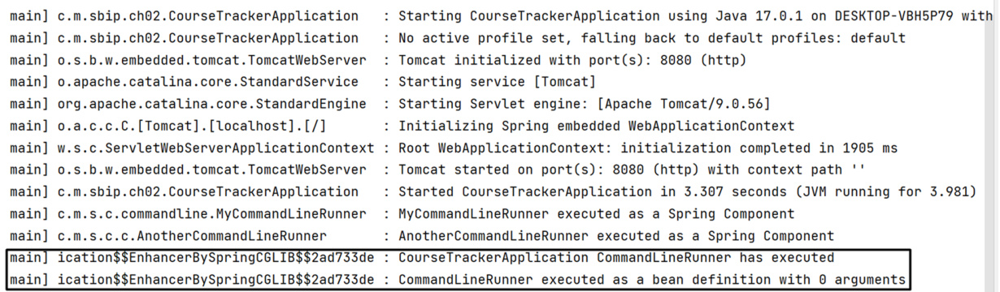

# 第 2 章 — 常见的 Spring Boot 任务（Common Spring Boot Tasks）

## 本章内容（This chapter covers）

- 在 Spring Boot 应用中管理配置  
- 使用 `@ConfigurationProperties` 创建自定义配置  
- 探索 `CommandLineRunner` 接口以执行初始化代码  
- 理解 Spring Boot 默认日志机制并配置 `Log4j2` 日志  
- 在 Spring Boot 应用中使用 Bean Validation 验证用户数据  

到目前为止，我们已经了解了 Spring Boot 的基本概念，以及它通过抽象底层细节来改善应用开发体验的目的。

在本章中，你将进一步加深对这些概念的理解，学习若干关键内容，包括如何管理应用配置以及为应用创建自定义配置。同时，你还将学习使用 Spring Boot 完成一些常见的开发任务——这些任务在构建 Spring Boot 应用时会经常遇到。

## 2.1 管理配置（Managing Configurations）

应用配置管理是任何应用程序的重要组成部分，Spring Boot 应用也不例外。  
根据你的开发与部署方式，你的应用可能需要在多个环境中运行（例如：`dev`、`test`、`staging`、`prod`）。  
在一个组织中，你可能会有多个运行环境：一个用于开发、一个用于测试、一个用于预发布、一个用于生产。  

在这些不同环境下，应用的核心代码通常保持一致，但配置却需要根据环境进行调整。  
例如，数据库配置或安全配置在不同环境中会有所不同。  
随着应用的功能越来越多、依赖越来越复杂，管理配置的难度也会随之上升。

Spring Boot 提供了多种方法，允许你在不修改源码的前提下实现 **外部化配置**。  
这些方法包括使用属性文件（`property files`）、`YAML` 文件、环境变量以及命令行参数等。  

在接下来的小节中，我们将详细介绍这些方式，并演示如何在 Spring Boot 应用中管理配置。  
如果你希望参考完整代码，可以从 GitHub 仓库下载示例项目。

### 2.1.1 使用 SpringApplication 类（Using the SpringApplication Class）

> 💡 **源码位置**  
> 本节示例项目可以[点击这里](https://github.com/honkinglin/spring-boot-in-practice/tree/main/ch02/spring-application)查看  

你可以使用 Spring Boot 提供的 `SpringApplication` 类在应用中定义配置。  
该类提供了一个名为 `setDefaultProperties()` 的方法，接收一个 `java.util.Properties` 或 `java.util.Map<String, Object>` 实例，用于设置应用属性。  

这种方式适合定义一些**一次性配置**，例如你不希望每次都改动的固定参数。

例如，你可以在 `application.properties` 文件中通过 `spring.config.import` 属性导入额外的配置文件：  

```properties
spring.config.import=classpath:additional-application.properties
```

Spring Boot 会从指定路径加载额外的配置文件。  
如果文件不存在，Spring Boot 会抛出 `ConfigDataLocationNotFoundException`。  
不过，你也可以配置 `spring.config.on-not-found` 属性来指定当文件不存在时的行为，例如：

```java
package com.manning.sbip.ch02;

import java.util.Properties;
import org.springframework.boot.SpringApplication;
import org.springframework.boot.autoconfigure.SpringBootApplication;

@SpringBootApplication
public class SpringBootAppDemoApplication {

    public static void main(String[] args) {
        Properties properties = new Properties();
        properties.setProperty("spring.config.on-not-found", "ignore");

        SpringApplication application =
                new SpringApplication(SpringBootAppDemoApplication.class);
        application.setDefaultProperties(properties);
        application.run(args);
    }
}
```

如上所示，我们通过 `SpringApplication` 实例调用 `setDefaultProperties()`，并在其中设置了 `spring.config.on-not-found=ignore`。  
这使得当配置文件不存在时，应用不会中断启动过程。

### 2.1.2 使用 @PropertySource 注解（Using @PropertySource）

> 💡 **源码位置**
> 本节示例项目可以[点击这里](https://github.com/honkinglin/spring-boot-in-practice/tree/main/ch02/property-sources)查看

在 Spring 的配置类中，可以使用 `@PropertySource` 注解加载指定路径下的属性文件。  
以下示例展示了如何定义一个配置类来加载数据库配置文件：

```java
package com.manning.sbip.ch02;

import org.springframework.beans.factory.annotation.Autowired;
import org.springframework.context.annotation.Configuration;
import org.springframework.context.annotation.PropertySource;
import org.springframework.core.env.Environment;

@Configuration
@PropertySource("classpath:dbConfig.properties")
public class DbConfiguration {

    @Autowired
    private Environment env;

    @Override
    public String toString() {
        return "Username: " + env.getProperty("user")
                + ", Password: " + env.getProperty("password");
    }
}
```

上面的代码定义了一个 Spring 配置类，并通过 `@PropertySource` 注解加载了 `dbConfig.properties` 文件中的属性。  
文件内容如下：

```properties
# Listing 2.3 dbConfig.properties
user=sa
password=p@ssw0rd
```

在应用主类中，我们可以获取并打印这些配置属性：

```java
package com.manning.sbip.ch02;

import org.slf4j.Logger;
import org.slf4j.LoggerFactory;
import org.springframework.boot.SpringApplication;
import org.springframework.boot.autoconfigure.SpringBootApplication;
import org.springframework.context.ConfigurableApplicationContext;

@SpringBootApplication
public class SpringBootAppDemoApplication {

    private static final Logger log =
            LoggerFactory.getLogger(SpringBootAppDemoApplication.class);

    public static void main(String[] args) {
        ConfigurableApplicationContext context =
                SpringApplication.run(SpringBootAppDemoApplication.class, args);

        DbConfiguration dbConfig = context.getBean(DbConfiguration.class);
        log.info(dbConfig.toString());
    }
}
```

运行应用后，控制台会输出从配置文件中读取到的用户名和密码。

::: tip

**关于 @PropertySource 的补充说明**

* `@PropertySource` 注解**不支持 YAML (`.yml` 或 `.yaml`) 文件**。
  如果希望使用 YAML 文件，需要额外编写代码实现加载逻辑。

* 在 **Java 8 及以上版本**，你可以重复使用多个 `@PropertySource` 注解，以加载多个配置文件，例如：

```java
@Configuration
@PropertySource("classpath:dbConfig.properties")
@PropertySource("classpath:redisConfig.properties")
public class DbConfiguration {
    // ...
}
```

此配置会同时加载 `dbConfig.properties` 与 `redisConfig.properties` 文件中的属性。

:::

### 2.1.3 配置数据文件（Config Data File）

> 💡 **源码地址**  
> 本节对应示例项目可以[点击这里](https://github.com/honkinglin/spring-boot-in-practice/tree/main/ch02/config-data-file)查看：  

Spring Boot 允许你在 `application.properties` 或 `application.yml` 文件中定义应用程序配置属性。    
这是 Spring Boot 应用中最常见、最推荐的配置方式。  

默认情况下，Spring Initializr 生成的 Spring Boot 项目会包含一个空的 `application.properties` 文件。  
如果你更喜欢使用 YAML 格式，也可以在项目中创建 `application.yml` 文件来替代。  
无论是 `.properties` 还是 `.yml` 文件，Spring Boot 都会将其中的配置加载到 `Environment` 实例中，  
并可以在应用中通过 `@Value` 注解直接引用这些配置。

::: tip

**Properties 或 YAML 文件示例**

Spring Boot 支持使用 `.properties` 或 `.yml` 文件进行配置。  
`.properties` 文件采用键值对形式，通过 `=` 分隔键和值，例如：

```properties
server.port=8081
spring.datasource.username=sa
spring.datasource.password=password
```

上述配置在 `.yml` 文件中的等价形式如下：

```yaml
server:
  port: 8081
spring:
  datasource:
    user: sa
    password: password
```

无论选择哪种格式，Spring Boot 都能正确识别（除少数语法差异外）。  
部分开发者更偏好使用 YAML，因为它支持层级结构、语法更简洁，并且能方便表示列表或映射等复杂数据结构。

不过，如果你选择 YAML 文件，需要特别注意 **缩进与空格**，一个额外的空格或错误的缩进都会导致解析失败。  
相对而言，`.properties` 文件更易于按名称快速定位属性。

:::


#### 自定义配置文件名

如果你希望使用不同于 `application.properties`（或 `.yml`）的配置文件名，可以通过 `spring.config.name` 属性轻松实现。

假设我们在 `src/main/resources` 目录下新建一个名为 `sbip.yml` 的文件，其中包含以下配置：

```yaml
server:
  port: 8081
```

你可以使用 Maven 构建项目：

```bash
mvn package
```

生成的可执行 JAR 文件中包含了应用组件。构建完成后，可通过以下命令运行：

```bash
java -jar config-data-file-0.0.1-SNAPSHOT.jar
```

> 默认情况下，Spring Boot 使用端口 `8080` 启动。
> 若要使用自定义配置文件启动（如 `sbip.yml`），可以执行以下命令：

```bash
java -jar config-data-file-0.0.1-SNAPSHOT.jar --spring.config.name=sbip
```

此时，Spring Boot 会读取 `sbip.yml` 文件，并在端口 `8081` 启动应用。


#### 配置文件的默认加载位置

Spring Boot 默认会在以下位置查找 `application.properties` 或 `application.yml` 文件：

1. 类路径根目录（`classpath root`）
2. 类路径下的 `/config` 目录
3. 当前工作目录（`current directory`）
4. 当前目录下的 `/config` 子目录
5. `/config` 目录的子目录

此外，你还可以通过 `spring.config.location` 属性显式指定配置文件路径，例如：

```bash
java -jar target/config-data-file-0.0.1-SNAPSHOT.jar \
  --spring.config.location=C:\sbip\repo\ch02\config-data-file\data\sbip.yml
```

> 上述命令会在 HTTP 端口 `8081` 启动应用，并从指定路径加载配置文件。


#### 可选配置文件（Optional Configuration）

从 Spring Boot **2.4.0** 开始，如果无法找到指定的配置文件，程序会抛出错误。
若希望文件是“可选”的，可在路径前添加 `optional:` 前缀：

```bash
java -jar target/config-data-file-0.0.1-SNAPSHOT.jar \
  --spring.config.location=optional:C:\sbip\repo\ch02\config-data-file\data\sbip1.yml
```

这样即使文件不存在，应用仍然可以正常启动。

::: tip

**关于 spring.config.name 与 spring.config.location**

Spring Boot 在**应用启动的早期阶段**就会加载 `spring.config.name` 和 `spring.config.location`，
因此这两个配置不能放在 `application.properties` 或 `application.yml` 中。

若需要设置它们，可以使用以下方式：

* 通过 `SpringApplication.setDefaultProperties()` 方法；
* 通过系统环境变量；
* 通过命令行参数。

:::

::: tip

**命令行参数（Command Line Arguments）**

Spring Boot 支持通过命令行传入配置参数。
例如，我们在执行 JAR 文件时可以这样指定：

```bash
java -jar config-data-file-0.0.1-SNAPSHOT.jar \
  --spring.config.name=sbip \
  --spring.config.location=file:data/sbip.yml
```

这与前面介绍的方式效果相同，只是配置以命令行参数形式传递。

:::

#### 基于 Profile 的配置文件（Profiles for Configuration）

Spring Boot 允许你为不同的运行环境定义独立的配置文件。
例如：

* `application-dev.properties`（开发环境）
* `application-test.properties`（测试环境）
* `application-prod.properties`（生产环境）

你可以在主配置文件中通过属性 `spring.profiles.active` 激活特定 Profile：

```properties
spring.profiles.active=dev
```

当激活 `dev` 时，应用会自动加载 `application-dev.properties` 文件。  
如果切换为 `test`，则会加载 `application-test.properties` 文件。

示例：

```properties
# application-dev.properties
server.port=9090

# application-test.properties
server.port=9091
```

#### 配置文件的加载顺序

Spring Boot 加载配置文件的顺序如下：

1. 打包在应用 JAR 内的默认 `application.properties` 或 `.yml` 文件
2. 打包在应用 JAR 内的 Profile 专属配置文件（如 `application-dev.properties`）
3. 位于 JAR 外部的默认配置文件
4. 位于 JAR 外部的 Profile 专属配置文件

这种分层加载机制使得配置既可以内置于应用中，又能根据部署环境灵活覆盖。

### 2.1.4 操作系统环境变量（OS Environment Variable）

> 💡 **源码地址**  
> 本节对应示例项目可以[点击这里](https://github.com/honkinglin/spring-boot-in-practice/tree/main/ch02/os-env-variables)查看：  

你可以将应用配置声明为系统环境变量，并在配置文件中通过变量名引用它。  
下面我们通过一个示例来演示如何实现这一点。  

假设在 `application.properties` 文件中定义了一个自定义属性 `app.timeout`，内容如下：

```properties
app.timeout=${APP_TIMEOUT}
```

这里的 `APP_TIMEOUT` 是一个操作系统环境变量，我们将在操作系统中为它赋值。  
在 Windows 中，你可以通过以下命令设置环境变量：

```bash
set APP_TIMEOUT=30
```

在 Linux 或 macOS 终端中，你可以使用：

```bash
export APP_TIMEOUT=30
```

需要注意的是，通过这种方式设置的环境变量**只在当前命令行会话中有效**。  
因此，运行 Spring Boot 应用时应在同一终端窗口执行。

#### 在应用中访问环境变量（Accessing Environment Variables）

我们可以在应用代码中读取该环境变量。  
下面的示例展示了如何访问 `app.timeout` 属性并输出其值：

```java
package com.manning.sbip.ch02;

// imports
import org.slf4j.Logger;
import org.slf4j.LoggerFactory;
import org.springframework.boot.SpringApplication;
import org.springframework.boot.autoconfigure.SpringBootApplication;
import org.springframework.context.ConfigurableApplicationContext;
import org.springframework.core.env.Environment;

@SpringBootApplication
public class SpringBootAppDemoApplication {

    private static final Logger log =
            LoggerFactory.getLogger(SpringBootAppDemoApplication.class);

    public static void main(String[] args) {
        ConfigurableApplicationContext context =
                SpringApplication.run(SpringBootAppDemoApplication.class, args);

        Environment env = context.getBean(Environment.class);
        log.info("Configured application timeout value: " + env.getProperty("app.timeout"));
    }
}
```

在上述代码中，我们从 `ConfigurableApplicationContext` 获取 `Environment` Bean，并使用 `env.getProperty("app.timeout")` 读取配置值。  
Spring Boot 会在运行时自动解析 `${APP_TIMEOUT}` 占位符并替换为真实值。


#### 默认值与覆盖机制（Default Values and Overrides）

在实际开发中，通常会在 `application.properties` 文件中提供默认配置，并在不同环境中通过环境变量覆盖这些默认值。

例如：

```properties
server.port=8080
```

你可以在环境变量中设置：

```bash
export SERVER_PORT=9090
```

此时应用启动端口会被覆盖为 `9090`。

#### 配置属性加载优先级（Order of Property Resolution）

当同一个属性在多个位置被定义时，Spring Boot 会按照一定顺序加载配置。  
优先级较高的配置会覆盖较低优先级的配置。顺序如下：

1. `SpringApplication`（通过 `setDefaultProperties()` 设置的属性）
2. `@PropertySource` 注解加载的属性
3. 配置文件（`application.properties` 或 `.yml`）
4. 操作系统环境变量（OS Environment Variable）
5. 命令行参数（Command Line Arguments）

因此，通过命令行参数指定的属性拥有最高优先级。

#### 深入阅读（Further Reading）

如果你希望更深入了解 Spring Boot 配置加载机制与优先级规则，可参考[官方文档](https://docs.spring.io/spring-boot/reference/features/external-config.html#features.external-config)

## 2.2 使用 @ConfigurationProperties 创建自定义配置（Creating Custom Properties with @ConfigurationProperties）

在上一节中，我们学习了多种配置 Spring Boot 应用属性的方法。  
这些配置大体可以分为两类：

- **Spring Boot 内置属性（built-in properties）**  
- **自定义属性（custom properties）**

Spring Boot 提供了大量内置属性，用于配置框架的各种功能。  
最常见的示例是 `server.port`，它定义了应用启动时使用的 HTTP 端口。  
你可以在 [Spring Boot 官方文档](https://docs.spring.io/spring-boot/index.html) 中找到完整的内置属性列表

### 定义自定义属性（Defining Custom Properties）

在某些情况下，你的应用需要配置与业务逻辑相关的属性。  
根据应用的复杂度和功能，你可能需要在配置文件中定义自定义属性。  
例如：

- 定义一个外部 REST 服务的访问地址；  
- 定义一个布尔值，用于启用或禁用某个功能。

Spring Boot 允许你在应用的配置文件中定义任意数量的属性，并在运行时自动加载和绑定这些配置。  

在上一节中，我们介绍过可以通过 `Environment` 对象获取属性，或使用 `@Value` 注解将属性注入到类中。  
这种方式简单有效，但也存在一些不足。

### 局限性（Limitations）

虽然直接通过 `@Value` 或 `Environment` 访问配置非常方便，但仍有以下缺点：

- **缺乏类型安全（Type-safety）**  
  通过属性文件配置的值通常以字符串形式加载，缺乏类型约束。  
  例如，当配置项是 URL 或电子邮件地址时，Spring 无法在编译或启动阶段验证其格式是否合法。  

- **访问繁琐**  
  需要逐个使用 `@Value` 注解或通过 `Environment` 实例获取属性值，这会导致代码分散且难以维护。

### 引入强类型配置（Strongly-Typed Configuration）

为了解决上述问题，Spring Boot 提供了另一种更优雅的方式：  
使用 `@ConfigurationProperties` 注解定义**强类型 Bean 配置类**。  

这种方式不仅可以在编译期保证类型安全（type-safety），还可以在应用启动时自动验证配置项是否合法。  
我们将在下一节详细介绍这种技术的使用方法。

### 2.2.1 技巧：在 Spring Boot 应用中使用 @ConfigurationProperties 定义自定义配置  
*(Technique: Defining Custom Properties with @ConfigurationProperties in a Spring Boot Application)*

**问题（Problem）**   
你需要在 Spring Boot 应用中定义可进行类型验证（type-safe）且可校验（validated）的自定义配置属性。

**解决方案（Solution）**  
> 💡 **源码地址**  
> 本节对应的 Spring Boot 示例项目可以[点击这里](https://github.com/honkinglin/spring-boot-in-practice/tree/main/ch02/configuration-properties)查看  

在本节中，我们将介绍如何使用 `@ConfigurationProperties` 在 Spring Boot 应用中定义自定义属性，并在代码中使用它们，而无需依赖 `@Value` 注解或 `Environment` 实例。  

#### 添加配置依赖（Adding Configuration Processor）

要在 IDE 中获得属性自动补全（autocompletion）和文档提示功能，需要在 `pom.xml` 中添加如下依赖：

```xml
<dependency>
    <groupId>org.springframework.boot</groupId>
    <artifactId>spring-boot-configuration-processor</artifactId>
    <optional>true</optional>
</dependency>
```

该依赖会为所有带有 `@ConfigurationProperties` 注解的类生成元数据（metadata），
IDE（如 IntelliJ IDEA 或 Eclipse）即可根据这些元数据提供自动提示。


### 定义自定义属性（Defining Custom Properties）

在 `application.properties` 文件中添加如下自定义属性：

```properties
app.sbip.ct.name=CourseTracker
app.sbip.ct.ip=127.0.0.1
app.sbip.ct.port=9090
app.sbip.ct.security.enabled=true
app.sbip.ct.security.token=asdfE998hhyqtghtYTggghg9908jjh7ttr
app.sbip.ct.security.roles=USER,ADMIN
```

这些属性并非 Spring Boot 内置属性，而是针对我们应用的特定配置项。


#### 创建配置类（Creating Configuration Class）

接下来，我们创建一个用于映射这些配置项的 Java 类 `AppProperties`：

```java
package com.manning.sbip.ch02.configurationproperties;

import java.util.List;
import org.springframework.boot.context.properties.ConfigurationProperties;
import org.springframework.boot.context.properties.ConstructorBinding;

@ConstructorBinding
@ConfigurationProperties("app.sbip.ct")
public class AppProperties {

    private final String name;      // Application Name
    private final String ip;        // Application IP
    private final int port;         // Application Port
    private final Security security; // Security Configuration

    public AppProperties(String name, String ip, int port, Security security) {
        this.name = name;
        this.ip = ip;
        this.port = port;
        this.security = security;
    }

    public String getName() { return name; }
    public String getIp() { return ip; }
    public int getPort() { return port; }
    public Security getSecurity() { return security; }

    @Override
    public String toString() {
        return "AppProperties{" +
                "name='" + name + '\'' +
                ", ip='" + ip + '\'' +
                ", port=" + port +
                ", security=" + security +
                '}';
    }

    // 嵌套类：安全配置
    public static class Security {
        private final boolean enabled;
        private final String token;
        private final List<String> roles;

        public Security(boolean enabled, String token, List<String> roles) {
            this.enabled = enabled;
            this.token = token;
            this.roles = roles;
        }

        public boolean isEnabled() { return enabled; }
        public String getToken() { return token; }
        public List<String> getRoles() { return roles; }

        @Override
        public String toString() {
            return "Security{" +
                    "enabled=" + enabled +
                    ", token='" + token + '\'' +
                    ", roles=" + roles +
                    '}';
        }
    }
}
```

#### 说明（Explanation）

* 该类通过 `@ConfigurationProperties("app.sbip.ct")` 指定属性前缀；
* 使用 `@ConstructorBinding` 表示通过构造函数注入属性（即不可变绑定方式）；
* 内部静态类 `Security` 对应配置项 `app.sbip.ct.security.*`，表示嵌套结构属性；
* 该设计具有良好的**层次结构**和**类型安全性**。


#### 定义服务类（Defining a Service Class）

创建一个服务类 `AppService`，用于注入并使用 `AppProperties`：

```java
package com.manning.sbip.ch02;

import org.springframework.beans.factory.annotation.Autowired;
import org.springframework.stereotype.Service;

@Service
public class AppService {

    private final AppProperties appProperties;

    @Autowired
    public AppService(AppProperties appProperties) {
        this.appProperties = appProperties;
    }

    public AppProperties getAppProperties() {
        return this.appProperties;
    }
}
```

该类使用 `@Service` 注解标记，Spring Boot 会自动扫描并注册。
通过构造函数注入 `AppProperties` 实例，以便在服务中访问配置属性。


#### 启动类中启用配置（Enabling Configuration in the Application Class）

接下来，在应用主类中使用 `@EnableConfigurationProperties` 启用该配置类：

```java
package com.manning.sbip.ch02;

import org.slf4j.Logger;
import org.slf4j.LoggerFactory;
import org.springframework.boot.SpringApplication;
import org.springframework.boot.autoconfigure.SpringBootApplication;
import org.springframework.boot.context.properties.EnableConfigurationProperties;
import org.springframework.context.ConfigurableApplicationContext;

@SpringBootApplication
@EnableConfigurationProperties(AppProperties.class)
public class SpringBootAppDemoApplication {

    private static final Logger log =
            LoggerFactory.getLogger(SpringBootAppDemoApplication.class);

    public static void main(String[] args) {
        ConfigurableApplicationContext context =
                SpringApplication.run(SpringBootAppDemoApplication.class, args);

        AppService appService = context.getBean(AppService.class);
        log.info(appService.getAppProperties().toString());
    }
}
```

* `@EnableConfigurationProperties(AppProperties.class)` 用于将带有 `@ConfigurationProperties` 的类注册到 Spring 容器中。
* 启动后，`application.properties` 文件中的配置会被读取、校验，并自动绑定到 `AppProperties` 实例上。

如果项目中有多个配置类，也可以使用 `@ConfigurationPropertiesScan` 扫描整个包路径，而无需单独指定类名。


#### 讨论（Discussion）

`@ConfigurationProperties` 提供了一种结构化且类型安全的方式来加载配置属性。
它支持将配置分组到不同的类别中，从而提升项目的可维护性。

* `@ConfigurationProperties("app.sbip.ct")`：指定配置前缀；
* 支持通过构造函数注入（使用 `@ConstructorBinding`）或 Setter 方法绑定；
* 如果类只有一个构造函数，可直接在类级别使用 `@ConstructorBinding`。

当你需要默认值时，可以使用 `@DefaultValue` 注解。
例如：

```java
public AppProperties(String name, String ip, @DefaultValue("8080") int port, Security security) {
    this.name = name;
    this.ip = ip;
    this.port = port;
    this.security = security;
}
```

在此示例中，如果未配置 `app.sbip.ct.port`，则默认使用端口 `8080`。

更多关于 `@ConfigurationProperties` 的信息可参考[官方文档](https://docs.spring.io/spring-boot/reference/features/external-config.html#features.external-config.typesafe-configuration-properties)

## 2.3 在 Spring Boot 应用启动时执行代码  
*(Executing Code on Spring Boot Application Startup)*

在某些情况下，你可能需要在 Spring Boot 应用启动时执行一些自定义逻辑。  
例如：

- 在应用初始化完成前执行数据库初始化脚本；  
- 调用一个 REST 服务以加载应用所需数据。

Spring Boot 提供了两个接口来实现这一点：  
`CommandLineRunner` 和 `ApplicationRunner`。  
这两个接口都包含一个单一的 `run(...)` 方法，并会在 Spring Boot 应用初始化完成前被调用一次。

本节将主要介绍 `CommandLineRunner` 的使用，  
而 `ApplicationRunner` 与其非常类似，可作为扩展练习。


### 2.3.1 技巧：使用 CommandLineRunner 在启动时执行代码  
*(Technique: Using CommandLineRunner to Execute Code at Spring Boot Application Startup)*

#### 问题（Problem）
你希望在 Spring Boot 启动时执行一些初始化逻辑。

#### 解决方案（Solution）
你可以通过多种方式配置 `CommandLineRunner`：

- 在主类中实现 `CommandLineRunner` 接口；  
- 使用 `@Bean` 定义一个 `CommandLineRunner` Bean；  
- 将 `CommandLineRunner` 定义为一个带有 `@Component` 注解的独立类。

> 💡 **源码地址**  
> 本节对应示例项目[可以点击](https://github.com/honkinglin/spring-boot-in-practice/tree/main/ch02/command-line-runner/spring-boot-app-final)这里查看

#### 示例一：在主类中实现 CommandLineRunner

```java
package com.manning.sbip.ch02;

// imports

@SpringBootApplication
public class CourseTrackerApplication implements CommandLineRunner {

    protected final Log logger = LogFactory.getLog(getClass());

    public static void main(String[] args) {
        SpringApplication.run(CourseTrackerApplication.class, args);
    }

    @Override
    public void run(String... args) throws Exception {
        logger.info("CourseTrackerApplication CommandLineRunner has executed");
    }
}
```

在该示例中，应用启动时会在控制台输出日志消息。



#### 示例二：将 CommandLineRunner 定义为 Spring Bean

```java
package com.manning.sbip.ch02;

// imports

@SpringBootApplication
public class CourseTrackerApplication {

    protected final Logger logger = LoggerFactory.getLogger(getClass());

    public static void main(String[] args) {
        SpringApplication.run(CourseTrackerApplication.class, args);
    }

    @Bean
    public CommandLineRunner commandLineRunner() {
        return args -> {
            logger.info("CommandLineRunner executed as a bean definition with "
                        + args.length + " arguments");
            for (int i = 0; i < args.length; i++) {
                logger.info("Argument: " + args[i]);
            }
        };
    }
}
```

该示例使用 Java Lambda 表达式定义了一个函数式接口实现。  
`CommandLineRunner` 是一个函数式接口（functional interface），仅包含 `run(String... args)` 方法。  
在此方法中，你可以访问命令行参数并执行自定义逻辑。

运行命令：

```bash
java -jar command-line-runner-0.0.1-SNAPSHOT.jar Spring
```

Spring 将作为参数传递给 `CommandLineRunner` 的 `args`。

这种方式的优点是无需在主类上实现接口，更加灵活和简洁。

::: tip

**@Bean vs @Component**

* `@Bean` 用于你**无法直接访问源码**的类，例如第三方依赖；
* `@Component` 用于你**可以修改源码**的类，直接在类上标注注解即可。

:::


#### 示例三：使用 @Component 注解定义 CommandLineRunner

```java
package com.manning.sbip.ch02.commandline;

// imports

// Order 注解定义了注解组件的排序顺序。例如，如果您有多个 CommandLineRunner 实例，您可以使用 Order 注解来指定它们的执行顺序。
@Order(1)
@Component
public class MyCommandLineRunner implements CommandLineRunner {

    protected final Logger logger = LogFactory.getLogger(getClass());

    @Override
    public void run(String... args) throws Exception {
        logger.info("MyCommandLineRunner executed as a Spring Component");
    }
}
```

Spring Boot 会自动扫描该组件并实例化它。  
你可以使用 `@Order` 注解定义多个 `CommandLineRunner` 的执行顺序。


#### 示例四：定义多个 Runner 并控制执行顺序

```java
package com.manning.sbip.ch02.commandline;

// imports

@Order(2)
@Component
public class AnotherCommandLineRunner implements CommandLineRunner {

    protected final Logger logger = LogFactory.getLogger(getClass());

    @Override
    public void run(String... args) throws Exception {
        logger.info("AnotherCommandLineRunner executed as a Spring Component");
    }
}
```

当应用启动时，`@Order(1)` 的 Runner 会先执行，接着执行 `@Order(2)` 的 Runner。   
你会在控制台日志中看到顺序输出。


#### 自动注入依赖（Autowired Dependencies）

`CommandLineRunner` 在 Spring Boot 应用**初始化即将完成时执行**，此时所有 Bean 都已被创建，可以安全地进行依赖注入。

例如：

```java
@Bean
public CommandLineRunner printCourses(CourseRepository courseRepository) {
    return args -> {
        System.out.println("=========== Course Details ===========");
        courseRepository.findAll().forEach(System.out::println);
    };
}
```

这里的 `CourseRepository` 是一个 Spring Data Repository，将在第 3 章中详细介绍。  
目前只需理解：Spring 会自动将该依赖注入到 `CommandLineRunner` 中。


#### 总结（Summary）

通过本节，你学习了三种在应用启动时执行代码的方式：

1. **在主类中实现 `CommandLineRunner` 接口**

   * 简单直接，但只能定义一个，无法控制执行顺序。
2. **使用 `@Bean` 定义 CommandLineRunner Bean**

   * 支持多实例、可访问外部依赖、可传参。
3. **使用 `@Component` 定义独立的 CommandLineRunner 类**

   * 结构更清晰，可通过 `@Order` 控制执行顺序。

✅ 前两种方式适合简单逻辑；   
✅ 第三种方式适合模块化管理启动逻辑，让主类保持简洁。

