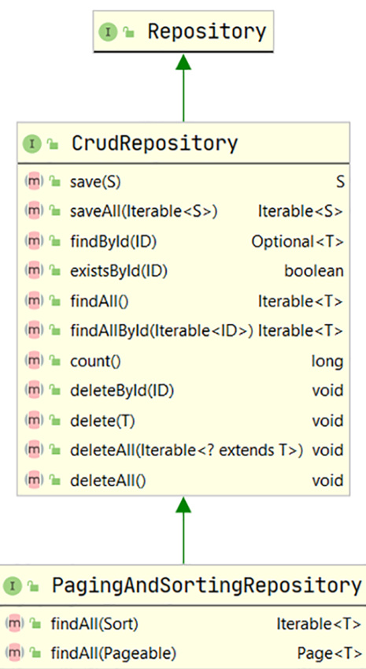

# 第 3 章 使用 Spring Data 进行数据库访问 (Database access with Spring Data)

### 本章内容涵盖

* 介绍 Spring Data 的概念、使用场景及其主要模块；
* 配置关系型数据库与 NoSQL 数据库（如 MongoDB），并在 Spring Boot 应用中访问数据；
* 启用 Spring Data JPA 以使用关系型数据库管理业务对象；
* 通过多种技术访问关系型数据库，包括 `@NamedQuery`、`@Query`、Criteria API 和 Querydsl。

现代应用程序几乎都需要数据库来存储应用数据，Spring Boot 应用也不例外。
在前两章中，我们学习了 Spring Boot 的基础概念、配置方式和运行机制。
有了这些基础，我们可以继续学习如何让应用与数据库交互。

在本章中，你将学习如何使用 **Spring Data** 与数据库通信。
我们将探索其配置方式、数据初始化、数据访问与对象管理的完整流程，
并体会到在 Spring Boot 中执行数据库操作的便捷性。

## 3.1 认识 Spring Data（Introducing Spring Data）

[Spring Data](https://spring.io/projects/spring-data) 是一个可以让你方便访问各种数据源的框架，包括关系型数据库与非关系型数据库（如 MongoDB）、MapReduce 数据库、以及云端数据服务等。

Spring Data 的目标是：  
提供一种统一、简单、熟悉的编程模型，让开发者在 Spring 体系中轻松实现数据访问。

Spring Data 是一个 “**伞形项目（umbrella project）**”，它包含多个子项目，每个子项目针对特定类型的数据库。

例如：

* **Spring Data JPA**：专注于关系型数据库（H2、MySQL、PostgreSQL 等）；
* **Spring Data MongoDB**：专注于 MongoDB 数据库。

### Java 持久化 API（Java Persistence API, JPA）

在现代应用中，程序通常需要与数据库通信以存储或读取数据。  
而传统的 JDBC 方式要求开发者编写大量模板代码，例如：

* 获取数据库连接；
* 定义 `PreparedStatement`；
* 设置参数；
* 执行查询；
* 管理资源关闭。

这些样板化步骤使得代码冗长且难以维护。

::: tip

**JPA（Java Persistence API）** 解决了这一问题。  
它在 Java 对象模型（例如业务实体类）与关系数据库模型（如表结构）之间建立了桥梁，从而实现了 **对象关系映射（Object-Relational Mapping, ORM）**。

如下图所示：


> 图 3.1 对象关系映射示意图
> 实体（Entity）表示业务对象，持久化提供者（Persistence Provider）负责实现 JPA 规范。

JPA 本身只是一个**规范（specification）**，定义了一套接口、类和注解。  
它的职责是规范化 ORM 技术，使得开发者可以轻松、统一地进行数据持久化操作。

常见的 JPA 实现包括：

* [**Hibernate**](https://hibernate.org/orm/)
* [**EclipseLink**](https://www.eclipse.org/eclipselink/#jpa)

这些框架提供了对 JPA 规范的具体实现，从而让我们能够在 Spring 应用中轻松地完成数据库持久化与对象操作。

:::

### 3.1.1 为什么选择 Spring Data（Why Spring Data）

Spring Data 的核心主题之一是提供一种一致的编程模型，用于访问各种数据源。  
因此，它提供了一个便捷的 API，使开发者可以为业务领域对象指定元数据（metadata），并确保这些对象能够被持久化到指定的数据存储中。

例如，你可以使用关系型数据库，并通过 **Spring Data JPA** 来管理业务对象。  
你可以在业务对象中添加 JPA 注解，而 Spring Data JPA 会确保这些领域对象被正确地持久化到数据库表中。  
在本章的后续部分中，你将会看到许多这类注解及其在业务对象中的用法。

Spring Data 各模块还以模板（template）类的形式提供 API，这种模式与 Spring 中常见的 `JdbcTemplate` 或 `JmsTemplate` 十分类似。  
例如，如果你使用的是 MongoDB，就可以使用 `MongoTemplate` 来在 MongoDB 数据库中执行各种操作。  
这些模板类提供了多种辅助方法，用于处理存储资源管理和异常转换（exception translation）等常见任务。

::: tip

**Spring templates**

Spring 模板类消除了原本在使用常见 API（例如 JDBC、JMS、JNDI）时所需编写的大量样板代码。  
这些样板代码通常包括：建立数据库连接、创建 `PreparedStatement`、执行查询、处理异常、关闭连接等。  
而 Spring 的模板类封装了这些步骤，让开发者可以专注于核心业务逻辑。

例如，使用 `JdbcTemplate` 时，你只需要提供要执行的 SQL 查询语句，其余的连接、执行、资源关闭等流程都由模板自动完成。

:::

Spring Data 还在所有支持的数据库之上提供了一个**仓库抽象层（repository abstraction layer）**，该抽象层为开发者提供了统一的编程模型。  
这个抽象层包含在 **Spring Data Commons** 模块中，并提供了一系列有用的接口，这些接口可用于执行标准的 CRUD 操作（创建 Create、读取 Read、更新 Update、删除 Delete）以及执行查询。

该抽象层位于 Spring Data 的最上层，同时也是其他所有 Spring Data 模块的基础。

### 3.1.2 Spring Data 模块（Spring Data Modules）

在前一节中，你已经了解了 Spring Data 的作用。  
在本节中，我们将进一步学习 Spring Data 的各个模块。  
你可以参考官方文档获取完整模块列表：
[https://spring.io/projects/spring-data](https://spring.io/projects/spring-data)

::: tip

**Spring Data modules**

Spring Data 是一个为多种主流数据存储系统提供支持的“伞形项目（umbrella project）”。   
表 3.1 总结了其中几个常用模块及其用途。

| 模块名称                                 | 用途                             |
| ------------------------------------ | ------------------------------ |
| **Spring Data Commons**              | 包含所有 Spring Data 项目中使用的基础组件。   |
| **Spring Data JDBC**                 | 提供基于 JDBC 的仓库支持。               |
| **Spring Data JPA**                  | 提供基于 JPA 的仓库支持。                |
| **Spring Data MongoDB**              | 提供基于文档的 MongoDB 数据库支持。         |
| **Spring Data REDIS**                | 提供 Redis 数据存储的支持。              |
| **Spring Data REST**                 | 允许将 Spring Data 仓库暴露为 REST 资源。 |
| **Spring Data for Apache Cassandra** | 提供 Apache Cassandra 数据库支持。     |

你可以参考 [Spring Data Reference](https://spring.io/projects/spring-data) 文档，查看完整的 Spring Data 项目列表。

:::

在所有模块中，**Spring Data Commons** 模块是最重要的一个。  
它由 Spring Data 的基础组件组成，这些组件与具体数据源无关，并被其他 Spring Data 模块复用。

例如：

* Spring Data JPA 模块依赖于 Spring Data Commons；
* Spring Data JPA 的 `JpaRepository` 接口是 Spring Data Commons 模块中 `PagingAndSortingRepository` 接口的子接口；
* 而 `PagingAndSortingRepository` 又继承了 `CrudRepository`；
* 通过这种继承关系，Spring Data Commons 提供了 CRUD、分页与排序的核心功能。

#### 图 3.2 Spring Data 模块结构（Spring Data Modules）


> **图 3.2** Spring Data 模块结构：
> Spring Data Commons 模块为其他子模块提供了基础，
> 每个子模块都面向特定类型的数据库（例如 MySQL、PostgreSQL、MongoDB）。
> `Repository`、`CrudRepository` 和 `PagingAndSortingRepository` 都是由 Commons 模块定义的接口。

Spring Data 的子模块包含针对特定数据库技术（例如 JDBC、JPA）或供应商（例如 MongoDB、Cassandra）的实现。  
这些子模块利用 Spring Data Commons 提供的核心框架特性，从而在不同数据库之间保持统一的编程体验。

## 3.2 在 Spring Boot 应用中配置数据库（Configuring a database in a Spring Boot application）

在任何应用中，配置并访问数据库都是一项基础操作，Spring Boot 应用也不例外。  
Spring Boot 提供了多种技术，帮助你在应用中配置并访问数据库。下面我们来看如何在 Spring Boot 应用中配置并访问一个关系型数据库。

### 3.2.1 技巧：在 Spring Boot 应用中配置关系型数据库（Technique: Configuring a relational database in a Spring Boot application）

在本技巧中，我们将演示如何在 Spring Boot 应用中配置关系型数据库。

#### 问题（Problem）

大多数应用都需要与数据库交互以存储和检索数据。但在与数据库通信之前，你必须先在应用中完成数据库配置。
你需要在 Spring Boot 应用中配置并访问一个关系型数据库。

#### 解决方案（Solution）

要在 Spring Boot 中配置关系型数据库，可以在 `pom.xml` 中添加 `spring-boot-starter-data-jpa` 与相应数据库驱动依赖。  
此外，你还需要提供数据库连接的详细信息，例如用户名、密码、驱动类以及连接 URL。

::: tip

**使用哪种关系型数据库？**

在演示中，我们使用内存型关系数据库 [**H2**](https://www.h2database.com/html/main.html)。
当然，你也可以使用任何其他关系型数据库继续完成本技巧，例如 [MySQL](https://www.mysql.com/)、[Oracle](http://mng.bz/y4xB) 或 [PostgreSQL](https://www.postgresql.org/)。   
除了更换数据库驱动及相关配置参数外，配置步骤保持一致。

需要保证你所使用的数据库实例正在运行，以便 Spring Boot 应用能够连接到它。你可以在本地安装并配置数据库，也可以使用来自云服务商（如 AWS、Azure）的数据库实例。  
对于云端数据库，你只需更换连接 URL，其他配置保持不变。本示例使用嵌入式的 H2 内存数据库。

源代码（Source code）  
可在配套 GitHub 仓库获取本技巧所用 Spring Boot 项目的[基础版本](https://github.com/honkinglin/spring-boot-in-practice/tree/main/ch03/configuring-relational-database/course-tracker-start) 和 [完成版项目](https://github.com/honkinglin/spring-boot-in-practice/tree/main/ch03/configuring-relational-database/course-tracker-final)。

:::

在 `pom.xml` 中添加如下两个依赖（可放在 `<dependencies>` 任意位置）：

```xml
<!-- Listing 3.1 Spring Data JPA starter 和 H2 依赖 -->
<dependency>
    <groupId>org.springframework.boot</groupId>
    <artifactId>spring-boot-starter-data-jpa</artifactId>
</dependency>

<dependency>
    <groupId>com.h2database</groupId>
    <artifactId>h2</artifactId>
    <scope>runtime</scope>
</dependency>
```

在清单 3.1 中，第一条依赖引入 Spring Data JPA，第二条依赖则将 H2 数据库驱动加入到项目中。   
如果使用除 H2 以外的数据库，请在 `pom.xml` 中加入对应的数据库驱动依赖（可在 Maven Central 查找）。

其中，Spring Data JPA 让你可以通过 ORM 技术在无需显式编写 SQL 的情况下管理业务领域对象；   
而 H2 的内存模式允许你在 Spring Boot 应用中使用嵌入式数据库（数据会在应用重启时清空）。

接下来在应用的 `application.properties` 中添加 H2 的连接信息：

```properties
# Listing 3.2 带有 H2 数据库配置的应用属性
spring.datasource.url=jdbc:h2:mem:sbipdb       # 数据库 URL（本示例使用 sbipdb schema）
spring.datasource.driverClassName=org.h2.Driver # H2 驱动类
spring.datasource.username=sa                   # 数据库用户名
spring.datasource.password=password             # 数据库密码
spring.h2.console.enabled=true                  # 启用 H2 控制台（仅 H2 可用）
```

清单 3.2 中提供了 H2 的连接 URL、驱动类、用户名、密码，并启用了 H2 控制台。  
H2 控制台提供了一个基于浏览器的 UI，可在内存数据库中执行 SQL。  
这些配置足以让 Spring Boot 在应用中创建并配置数据源。

为验证数据源是否正确创建，定义一个简单的单元测试，断言数据源类型与底层数据库产品名称（清单 3.3）：

```java
// Listing 3.3 用单元测试验证数据源细节
package com.manning.sbip.ch03;

// 省略 import 语句以保持可读性

@SpringBootTest
class CourseTrackerSpringBootApplicationTests {

    @Autowired
    private javax.sql.DataSource dataSource;

    @Test
    void givenDatasourceAvailableWhenAccessDetailsThenExpectDetails() throws java.sql.SQLException {
        // 断言数据源实现类为 HikariCP
        org.assertj.core.api.Assertions.assertThat(dataSource.getClass().getName())
            .isEqualTo("com.zaxxer.hikari.HikariDataSource");

        // 断言底层数据库产品名称为 H2
        org.assertj.core.api.Assertions.assertThat(
                dataSource.getConnection().getMetaData().getDatabaseProductName())
            .isEqualTo("H2");
    }
}
```

执行该测试用例后，你会看到两个断言均通过（见图 3.3）。


> 图 3.3 在 IntelliJ IDEA 中成功执行的单元测试（Unit test case executed successfully in IntelliJ IDEA）

#### 讨论（Discussion）

通过本技巧，你学习了如何用少量配置在 Spring Boot 应用中配置关系型数据库。  
例如，`application.properties` 中的数据库配置参数，加上类路径中的 Spring Data JPA 与 H2 驱动 jar，就能让 Spring Boot 在应用中配置一个 H2 数据源。  
此数据源即可被应用用于数据库通信。

作为数据库配置的一部分，Spring Boot 会自动配置 [**HikariCP**](https://github.com/brettwooldridge/HikariCP) 作为数据库连接池。  
连接池在应用启动时创建一组数据库连接，供应用复用。这样每次需要数据库连接时无需重新创建与销毁，使用后将连接归还连接池即可。Spring Boot 默认使用 HikariCP 作为连接池实现。

如果你想了解 HikariCP 依赖从何而来，可以在 IDE 中打开示例应用的 `pom.xml`，查看 `spring-boot-starter-data-jpa` 依赖的传递依赖关系：  
`spring-boot-starter-data-jpa` 依赖于 `spring-boot-starter-jdbc`，而后者又依赖 HikariCP（见图 3.4）。


> 图 3.4 HikariCP 连接池库的传递依赖（HikariCP connection pool library transitive dependency）

若需使用 HikariCP 以外的连接池库，可以在 `spring-boot-starter-data-jpa` 依赖上排除 HikariCP，并加入你选择的连接池库（如 Oracle UCP、Tomcat JDBC、DBCP2 等）。
清单 3.4 展示了如何排除 HikariCP 并改用 `tomcat-jdbc`：

```xml
<!-- Listing 3.4 在 POM 中排除 HikariCP 并加入 Tomcat 连接池 -->
<dependency>
    <groupId>org.springframework.boot</groupId>
    <artifactId>spring-boot-starter-data-jpa</artifactId>
    <exclusions>
        <exclusion>
            <groupId>com.zaxxer</groupId>
            <artifactId>HikariCP</artifactId>
        </exclusion>
    </exclusions>
</dependency>

<dependency>
    <groupId>org.apache.tomcat</groupId>
    <artifactId>tomcat-jdbc</artifactId>
</dependency>
```

基于清单 3.4 的配置，Spring Boot 选择连接池实现的策略如下：

1. 如果 **HikariCP** 不可用，而类路径中存在 **Apache Tomcat** 的连接池依赖，则使用 Tomcat 连接池。
2. 若 HikariCP 和 Apache Tomcat 连接池依赖都不可用，则尝试使用 [**Apache Commons DBCP2**](https://commons.apache.org/proper/commons-dbcp)。
3. 如果 DBCP2 也不可用，Spring Boot 会配置 JDK 的默认数据源（`javax.sql.DataSource`）。

在本技巧中，我们通过在 `application.properties` 中配置少量参数，使 H2 数据库在 Spring Boot 应用中可用。实际上，Spring Boot 还提供了大量可选配置以便对数据库配置进行微调。

例如，若使用默认的 HikariCP，你可能希望自定义连接池大小：可通过 `spring.datasource.hikari.maximum-pool-size` 指定每个池的最大连接数。    
如果使用其他连接池库，则需要配置对应库的特定属性。

若想进一步了解可用的数据库配置参数，可参考 [Spring Boot 文档](https://docs.spring.io/spring-boot/appendix/application-properties/index.html#appendix.application-properties.data) 的应用属性说明。

### 3.2.2 在 Spring Boot 应用中配置 MongoDB 数据库（Technique: Configuring MongoDB database in a Spring Boot application）

在本技巧中，我们将演示如何在 Spring Boot 应用中配置 MongoDB 数据库。

#### 问题（Problem）

你已经了解了如何在 Spring Boot 应用中配置关系型数据库。同时，随着关系型数据库之外的应用场景不断增长，NoSQL 数据库也逐渐流行起来。  
你需要在 Spring Boot 应用中配置常用的 NoSQL 数据库 MongoDB。

#### 解决方案（Solution）

MongoDB 是一种流行的 NoSQL 数据库，它以类似 JSON 的文档格式存储数据。  
Spring Boot 提供了便捷的方式，通过 `spring-boot-starter-data-mongodb` 依赖与 MongoDB 数据库集成。在本技巧中，你将学习如何从 Spring Boot 应用连接到 MongoDB 数据库。

::: tip Source code
你可以在书籍配套 GitHub 仓库中找到本技巧使用的 [Spring Boot 工程基础版本](https://github.com/honkinglin/spring-boot-in-practice/tree/main/ch03/configuring-mongodb-database/course-tracker-start) 

本技巧完成后的[最终版本](https://github.com/honkinglin/spring-boot-in-practice/tree/main/ch03/configuring-mongodb-database/course-tracker-final)
:::

要在 Spring Boot 中配置 MongoDB，你需要在项目的 `pom.xml` 文件中添加以下依赖，如下所示。

#### Listing 3.5 MongoDB Maven dependencies

```xml
<dependency>
    <groupId>org.springframework.boot</groupId>
    <artifactId>spring-boot-starter-data-mongodb</artifactId>
</dependency>
<dependency>
    <groupId>de.flapdoodle.embed</groupId>
    <artifactId>de.flapdoodle.embed.mongo</artifactId>
</dependency>
```

第一个依赖为 Spring Boot 应用提供 Spring Data MongoDB 支持。   
第二个依赖将 Flapdoodle 嵌入式 MongoDB 数据库添加到应用中。   
更多相关信息可参考 [这里](https://github.com/flapdoodle-oss/de.flapdoodle.embed.mongo)   
如果你使用真实 MongoDB 实例，则无需嵌入式依赖。

现在我们创建一个测试用例以验证如何使用 MongoDB，如下所示。

#### Listing 3.6 Unit test to validate the use of MongoDB in Spring Data

```java
package com.manning.sbip.ch03;

// Import statements are excluded as a matter of readability

import static org.assertj.core.api.Assertions.assertThat;

@DataMongoTest
@ExtendWith(SpringExtension.class)
class CourseTrackerSpringBootApplicationTests {

    @Autowired
    private MongoTemplate mongoTemplate;

    @Test
    public void givenObjectAvailableWhenSaveToCollectionThenExpectValue() {
        // given
        DBObject object = BasicDBObjectBuilder.start().add("Manning", "Spring Boot In Practice").get();
        // when
        mongoTemplate.save(object, "collection");
        // then
        assertThat(mongoTemplate.findAll(DBObject.class, "collection"))
            .extracting("Manning")
            .containsOnly("Spring Boot In Practice");
    }
}
```

让我们解释该测试用例执行的操作：

* 测试类中通过 `@Autowired` 注入了 `MongoTemplate`。实例由 Spring Boot 创建，`MongoTemplate` 是一个帮助类，用于执行 MongoDB 操作。  
* 你创建了一个文档，其中键为 Manning，值为 *Spring Boot in Practice*。MongoDB 将文档作为集合的一部分进行存储，因此你将该文档添加至名为 `collection` 的集合中。
* 最后，你从集合中读取该文档，提取 key，并断言返回的值。

### 讨论（Discussion）

关系型数据库以行和列的表格形式存储数据。然而，并非所有数据都适合以表格方式存储。   
有些情况下，数据是非结构化的，并以文档形式保存。NoSQL 数据库便是专为此类数据设计的，通常被称为**文档数据库**。  
MongoDB 是最流行且领先的文档数据库之一。

在本技巧中，你使用的是 MongoDB 的**内存实例**。这种方式可以快速引导应用，无需安装本地或远程数据库。

如果你拥有本地或远程 MongoDB 实例（例如云数据库），你可以移除嵌入式配置，并在 `application.properties` 中提供实际连接配置。以下示例展示可用的数据库配置。

#### Listing 3.7 MongoDB properties

```
spring.data.mongodb.authentication-database=<Authentication database name>
spring.data.mongodb.database=<Database name>
spring.data.mongodb.field-naming-strategy=<Field Naming Strategy>
spring.data.mongodb.gridfs.database=<GridFS database>
spring.data.mongodb.host=<Database Hostname>
spring.data.mongodb.password=<Database password>
spring.data.mongodb.port=<Database Port>
spring.data.mongodb.uri=<Database URI>
spring.data.mongodb.username=<Database Username>
spring.mongodb.embedded.version=2.6.10
```

* Authentication database name：认证数据库名称
* Fully qualified name of the FieldNamingStrategy to use：使用的 FieldNamingStrategy 完整类名
* Mongo server host：MongoDB 服务器主机
* GridFS database name：GridFS 数据库名称
* Login password of the Mongo server：MongoDB 登录密码
* Mongo server port（27017 默认）：MongoDB 服务端口
* Login password of the Mongo server：登录密码
* Mongo database URI（设置 URI 后将忽略 host & port）：数据库 URI
* Embedded MongoDB version：嵌入式 MongoDB 版本

你可以参考 [Spring Boot 官方文档](https://docs.spring.io/spring-boot/documentation.html#documentation.advanced) 以获取所有支持的配置属性。 

如果你是 MongoDB 新手，可以参考本书配套 GitHub wiki 提供的[入门指南](https://github.com/spring-boot-in-practice/repo/wiki/Beginners-Guide-to-MongoDB)。

### 3.2.3 初始化关系型数据库的模式（Technique: Initializing a relational database schema with a Spring Boot application）

在本技巧中，我们将讨论如何在 Spring Boot 应用中初始化关系型数据库的结构（schema）。

#### 问题

在前面的技巧中，你已经了解了如何在 Spring Boot 应用中配置关系型数据库。然而，在开始访问数据库之前，你必须确保数据库模式（schema）已正确初始化。
例如，所有必需的表与索引需要被创建，相关的数据插入脚本也要被执行。因此，必须在应用启动时初始化数据库的结构。

#### 解决方案

Spring Boot 允许你使用内置机制或第三方库（如 ORM 框架）来初始化数据库结构。在本技巧中，你将学习如何使用 Spring Data 的内置脚本 —— `schema.sql` 与 `data.sql` 来初始化数据库。

Spring Boot 会从类路径（如 `src/main/resources` 文件夹）或预定义位置加载 SQL 脚本。  
通常你会定义：

* `schema.sql` 文件：包含所有 **DDL（数据定义语言）** 脚本，用于创建数据库结构；
* `data.sql` 文件：包含所有 **DML（数据操作语言）** 脚本，用于插入初始化数据。

只需将这两个文件放入 `src/main/resources` 文件夹，Spring Boot 会在启动时自动检测并执行它们。

此外，还可以通过在 `application.properties` 中使用
`spring.datasource.schema` 和 `spring.datasource.data`
属性来定制这些行为。

#### DDL 与 DML 简介（DDL and DML in a nutshell）

* **DDL（Data Definition Language）**
  用于定义数据库结构（用户、模式、表、索引、约束等）。  
  例如，在 H2 数据库中创建一个名为 `AUTHORS` 的表：

  ```sql
  create table AUTHORS (
      id bigint not null,
      name varchar(255),
      primary key (id)
  );
  ```

* **DML（Data Manipulation Language）**
  用于操作数据，例如 `INSERT`、`UPDATE`、`DELETE`。  
  下例向 `AUTHORS` 表中插入一条数据：

  ```sql
  INSERT INTO AUTHORS(id, name) VALUES(1, 'John Doe');
  ```

#### 源码（Source code）

你可以从本书配套的 GitHub 仓库获取本技巧的示例项目：  
[基础版本](https://github.com/honkinglin/spring-boot-in-practice/tree/main/ch03/initialize-relational-database-with-schema/course-tracker-start)   
[最终版本](https://github.com/honkinglin/spring-boot-in-practice/tree/main/ch03/initialize-relational-database-with-schema/course-tracker-final)

在使用非嵌入式数据库时，需要在 `application.properties` 中设置：

```properties
spring.sql.init.mode=always
```

该属性指示 Spring Boot 始终初始化数据库结构。它支持三个取值：

* `embedded`：嵌入式数据库（默认值，如 H2）
* `always`：始终初始化
* `never`：从不初始化

当使用 H2 这类内存数据库时，可以忽略此项；但若使用 MySQL 等外部数据库，则应设为 `always`。

> 🔹 嵌入式数据库自动初始化，例如 [H2](https://www.h2database.com/html/main.html)

#### Listing 3.8 更新的 application.properties

```properties
spring.sql.init.mode=always
# 其他数据源属性，如用户名、密码、驱动名和连接 URL
```

> 该配置指示 Spring Boot 初始化数据库结构。默认仅对嵌入式数据库启用。对于 MySQL 等外部数据库，需显式配置为 `always`。

现在我们定义 `schema.sql` 与 `data.sql` 文件。

在本示例中，假设我们管理课程（Course）信息。  
业务对象为 `Course`，我们将在数据库中创建 `COURSES` 表，并在表中插入一些示例数据。

#### Listing 3.9 数据库结构定义（Database schema.sql configuration）

```sql
CREATE TABLE COURSES (
  id int(15) NOT NULL,
  name varchar(100) NOT NULL,
  category varchar(20) NOT NULL,
  rating int(1) NOT NULL,
  description varchar(1000) NOT NULL,
  PRIMARY KEY (id)
);
```

#### Listing 3.10 数据初始化脚本（Database initialization scripts）

```sql
INSERT INTO COURSES(ID, NAME, CATEGORY, RATING, DESCRIPTION)
VALUES(1, 'Rapid Spring Boot Application Development', 'Spring', 4,
'Spring Boot gives all the power of the Spring Framework without all of the complexities');

INSERT INTO COURSES(ID, NAME, CATEGORY, RATING, DESCRIPTION)
VALUES(2, 'Getting Started with Spring Security DSL', 'Spring', 3,
'Learn Spring Security DSL in easy steps');

INSERT INTO COURSES(ID, NAME, CATEGORY, RATING, DESCRIPTION)
VALUES(3, 'Scalable, Cloud Native Data Applications', 'Spring', 4,
'Manage Cloud based applications with Spring Boot');

INSERT INTO COURSES(ID, NAME, CATEGORY, RATING, DESCRIPTION)
VALUES(4, 'Fully Reactive: Spring, Kotlin, and JavaFX Playing Together', 'Spring', 3,
'Unleash the power of Reactive Spring with Kotlin and Spring Boot');

INSERT INTO COURSES(ID, NAME, CATEGORY, RATING, DESCRIPTION)
VALUES(5, 'Getting Started with Spring Cloud Kubernetes', 'Spring', 5,
'Master Spring Boot application deployment with Kubernetes');
```

#### 特定数据库的 SQL 文件（Database-specific schema and data SQL files）

除了 `schema.sql` 与 `data.sql` 外，Spring Boot 还支持**数据库特定 SQL 文件**。  
例如，如果应用同时支持多种数据库（语法存在差异），可以创建：

* `schema-h2.sql` / `data-h2.sql`
* `schema-mysql.sql` / `data-mysql.sql`

并在 `application.properties` 中指定当前使用的数据库平台：

```properties
spring.datasource.platform=h2
```

> 每次仅一个数据库处于激活状态。
> 你可以同时维护多组 SQL 文件，但通过 `spring.datasource.platform` 切换使用。

#### 验证数据库初始化（Unit test to validate schema initialization）

以下测试通过 JDBC 查询 `COURSES` 表中的课程数量，以验证 Spring Boot 是否成功执行了 SQL 初始化脚本。

##### Listing 3.11

```java
@SpringBootTest
class CourseTrackerSpringBootApplicationTests {

    @Autowired
    private DataSource dataSource;

    @Test
    public void whenCountAllCoursesThenExpectFiveCourses() throws SQLException {
        ResultSet rs = null;
        int noOfCourses = 0;

        try (PreparedStatement ps = dataSource.getConnection()
                .prepareStatement("SELECT COUNT(1) FROM COURSES")) {
            rs = ps.executeQuery();
            while (rs.next()) {
                noOfCourses = rs.getInt(1);
            }
            assertThat(noOfCourses).isEqualTo(5L);
        } finally {
            if (rs != null) rs.close();
        }
    }
}
```

该测试注入了 `DataSource` 并使用基础 JDBC 代码统计 `COURSES` 表中的记录数。  
在本示例中，我们通过 5 条 `INSERT` 语句插入了五个课程，因此断言结果为 5。

#### 自定义 schema 与 data 文件路径（Custom schema and data file location）

你也可以为 schema 和 data 文件指定不同路径或文件名，例如：

##### Listing 3.12

```properties
spring.sql.init.schema-locations=classpath:sql/schema/sbip-schema.sql
spring.sql.init.data-locations=classpath:sql/data/sbip-data.sql
```

如果文件位于文件系统（而非 classpath），也可使用：

```properties
spring.sql.init.data-locations=classpath:sql/data/sbip-data.sql,file:///c:/sql/data/reference-data.sql
```

#### 讨论（Discussion）

在本技巧中，你学习了如何使用 Spring Boot 内置功能通过简单 SQL 文件初始化数据库。

总结如下：

* 使用 `schema.sql` 提供数据库结构定义（DDL）；
* 使用 `data.sql` 提供数据填充逻辑（DML）；
* 可以根据数据库平台创建特定的 SQL 文件；
* 可通过 `spring.sql.init.*` 系列属性自定义路径与加载规则。

至此，你已掌握 Spring Boot 基础数据库配置与通信技巧。  
接下来（3.3 节），我们将学习如何使用 **Spring Data JPA** 管理数据库通信，以更简洁高效地完成 CRUD 操作。

## 3.3 理解 CrudRepository 接口（Understanding the CrudRepository interface）

在学习 `CrudRepository` 接口之前，你需要先了解 `Repository` 接口。  
Spring Data 的 repository 模块使用这个通用接口作为数据源的主要抽象。它接收一个**业务领域类（business domain class）**和其**标识符类型（identifier type）**作为泛型参数。

例如，在本书示例应用 **CourseTracker** 中，你需要管理课程信息，这些课程详情被表示为 `Course` 类实例，并拥有 `long` 类型的标识符。

### Repository 接口（The Repository interface）

`Repository` 是一个**标记接口（marker interface）**，主要用于捕获领域类及其 ID 类型信息。
标记接口本身没有任何方法或常量，只在运行时提供对象的类型信息。

#### Listing 3.13 Spring Data repository interface

```java
public interface Repository<T, ID> {}
```

### CrudRepository 接口（The CrudRepository interface）

`CrudRepository` 是 `Repository` 的子接口，提供了一组基础的 CRUD（增删改查）操作。

下方展示了来自 `spring-data-commons` 模块的接口定义。
你可以在此处查看源码：[http://mng.bz/jyzP](http://mng.bz/jyzP)

#### Listing 3.14 Spring Data CrudRepository methods

```java
public interface CrudRepository<T, ID> extends Repository<T, ID> {

    <S extends T> S save(S entity);        // 保存一个实体
    Optional<T> findById(ID id);           // 根据 ID 查找实体
    Iterable<T> findAll();                 // 查找所有实体
    long count();                          // 返回实体数量
    void deleteById(ID id);                // 根据 ID 删除实体

    // Additional methods excluded for brevity
}
```

> **说明**
> 该接口定义中，泛型参数 `T` 表示领域类（domain class），而 `ID` 表示该类的标识符类型。

除了 `CrudRepository` 之外，Spring Data 还提供了一个扩展接口 `PagingAndSortingRepository`。
该接口在 `CrudRepository` 的基础上，增加了分页（pagination）和排序（sorting）功能。

**下图展示了 Spring Data Commons 模块中的核心接口层次结构：**



### 3.3.1 使用 Spring Data JPA 管理关系型数据库中的领域对象 (Technique: Managing domain objects in a relational database with Spring Data JPA)

在本节中，我们将探索如何使用 Spring Data JPA 在关系型数据库中管理业务领域对象。

#### 问题（Problem）

你需要在 Spring Boot 应用中使用 Spring Data JPA 来管理关系型数据库中的领域对象。

#### 解决方案（Solution）

在上一节中，你学习了 Spring Data 的 Repository、CrudRepository 与 PagingAndSortingRepository 接口，它们允许你在 Spring Boot 应用中管理领域对象。

在本技巧中，你将学习如何使用 **CrudRepository** 来执行创建、读取、更新和删除（CRUD）等操作。

::: tip Source code
你可以在此处找到本技巧的 Spring Boot 项目[基础版本](https://github.com/honkinglin/spring-boot-in-practice/tree/main/ch03/manage-domain-objects-with-jpa/course-tracker-start) 和
[最终版本](https://github.com/honkinglin/spring-boot-in-practice/tree/main/ch03/manage-domain-objects-with-jpa/course-tracker-final)
:::

#### 修改领域对象：添加 JPA 注解

Spring Data JPA 管理的实体需要使用 JPA 注解。下面是经过修改的 `Course` 实体。

```java
import javax.persistence.*;

@Entity
@Table(name = "COURSES")
public class Course {

    @Id
    @Column(name = "ID")
    @GeneratedValue(strategy = GenerationType.IDENTITY)
    private Long id;

    @Column(name = "NAME")
    private String name;

    @Column(name = "CATEGORY")
    private String category;

    @Column(name = "RATING")
    private int rating;

    @Column(name = "DESCRIPTION")
    private String description;

    public Course(String name, String category,
                  int rating, String description) {
        this.name = name;
        this.category = category;
        this.rating = rating;
        this.description = description;
    }
    // Getter/setters, and toString is omitted
}
```

#### 你做的修改说明：

* **@Entity**
  将类标记为 JPA 实体。

* **@Table(name = "COURSES")**
  指定实体对应的数据库表名。

* **@Column**
  指定字段对应的数据库表列名。

* **@Id**
  指定主键字段。

* **@GeneratedValue(strategy = GenerationType.IDENTITY)**
  指定主键生成策略为自增。

#### 定义自定义 Repository（扩展 CrudRepository）

```java
package com.manning.sbip.ch03.repository;

import org.springframework.data.repository.CrudRepository;
import org.springframework.stereotype.Repository;

import com.manning.sbip.ch03.model.Course;

@Repository
public interface CourseRepository extends CrudRepository<Course, Long> {
    // The interface body is actually empty
}
```

你为 `CourseRepository` 添加了：

* `@Repository` 注解 → 让 Spring 识别它为数据访问组件
* 扩展 `CrudRepository<Course, Long>` → 自动继承所有 CRUD 方法

#### 编写单元测试验证 CRUD 操作

```java
@SpringBootTest
class CourseTrackerSpringBootApplicationTests {

    @Autowired
    private CourseRepository courseRepository;

    @Test
    public void givenCreateCourseWhenLoadTheCourseThenExpectSameCourse() {
        Course course =
            new Course("Rapid Spring Boot Application Development",
                    "Spring", 4,
                    "Spring Boot gives all the power of the Spring Framework without all of the complexities");
        Course savedCourse = courseRepository.save(course);
        assertThat(courseRepository.findById(savedCourse.getId())
            .get()).isEqualTo(course);
    }

    @Test
    public void givenUpdateCourseWhenLoadTheCourseThenExpectUpdatedCourse() {
        Course course =
            new Course("Rapid Spring Boot Application Development",
                    "Spring", 4,
                    "Spring Boot gives all the power of the complexities");
        courseRepository.save(course);
        course.setRating(5);
        Course savedCourse = courseRepository.save(course);
        assertThat(courseRepository.findById(savedCourse.getId())
            .get().getRating()).isEqualTo(5);
    }

    @Test
    public void givenDeleteCourseWhenLoadTheCourseThenExpectNoCourse() {
        Course course =
            new Course("Rapid Spring Boot Application Development",
                    "Spring", 4,
                    "Spring Boot gives all the power of the complexities");
        Course savedCourse = courseRepository.save(course);
        courseRepository.delete(savedCourse);
        assertThat(courseRepository.findById(savedCourse.getId())
            .isPresent()).isFalse();
    }
}
```

#### 本测试进行了三个验证：

* 创建课程并确认可通过 ID 查找到
* 更新课程评分并验证
* 删除课程并验证无法查询

### 讨论：JPA 注解的详细解释

#### @Entity

用于将 class 标记为 JPA 实体。实体会映射到数据库表。

#### @Table

指定数据库表名（默认使用类名）。  
你在此示例中设置为 `COURSES`。

#### @Id

标识主键字段。

#### @Column

默认使用类字段名作为列名，也可以自定义列名，例如：

```java
@Column(name = "COURSE_ID")
```

#### @GeneratedValue(strategy = ...)

可用策略：

* **Table**
  使用数据库表管理主键。

* **Identity**
  使用数据库自增列（你当前使用的策略）。

* **Sequence**
  使用数据库序列。

* **Auto**
  JPA 自动选择一个。

#### @Repository 注解的作用

* **自动检测（Auto Detection）**
  因为它是 `@Component` 的派生注解，Spring 会自动扫描它。

* **异常转换（Exception Translation）**
  将底层异常（如 `SQLException`）转换成 Spring 统一的 `DataAccessException`。

#### JPA 自动生成数据库 schema

通过 `spring.jpa.hibernate.ddl-auto` 属性管理：

* **none**：不生成
* **validate**：校验表结构
* **update**：更新表结构
* **create**：启动时创建表
* **create-drop**：启动创建、关闭时删除（默认用于内存数据库）

::: warning schema.sql vs ddl-auto
在上一节你学到 schema.sql
这里你学到 ddl-auto
两者不要同时启用，否则会冲突。
若使用 schema.sql，请将 ddl-auto 设置为 `none`。
:::

### 3.3.2 使用 Spring Data JPA 创建自定义仓库（Technique: Creating a custom Spring Data repository with Spring Data JPA to manage domain objects in a relational database）

在本技巧中，我们将演示如何创建自定义 Spring Data 仓库。

#### Problem（问题）

你希望使用 Spring Data 的仓库接口来管理应用程序的领域对象，但你不希望暴露所有 CRUD 方法。

#### Solution（解决方案）

Spring Data 仓库接口提供了非常优秀且简单的方式来管理业务领域对象。同时，如果框架提供的默认仓库接口不能满足你的需求，你也可以定义自定义仓库接口。

在本技巧中，你将定义一个自定义的 Spring Data 仓库接口，并将其应用到你的 Spring Boot 应用中。

#### Source code（源码）

[基础版本项目](https://github.com/honkinglin/spring-boot-in-practice/tree/main/ch03/creating-custom-spring-data-repository/course-tracker-start)  
[最终版本项目](https://github.com/honkinglin/spring-boot-in-practice/tree/main/ch03/creating-custom-spring-data-repository/course-tracker-final)  

#### 定义自定义基础仓库接口 BaseRepository

要创建自定义仓库，你需要定义一个基础仓库接口，该接口扩展 Spring Data 的 `Repository`。  
然后你可以选择性地暴露你希望开放的方法。

下面的 `BaseRepository` 仅暴露 `save()` 和 `findAll()` 两个方法：

```java
// Listing 3.18 Defining the BaseRepository interface
package com.manning.sbip.ch03.repository;

import org.springframework.data.repository.NoRepositoryBean;
import org.springframework.data.repository.Repository;

@NoRepositoryBean
public interface BaseRepository<T, ID> extends Repository<T, ID> {

    <S extends T> S save(S entity);

    Iterable<T> findAll();
}
```

#### 说明

* `@NoRepositoryBean`：表示这个接口只是一个基础接口，Spring Data 不会为其创建代理对象。
* 你选择性地提供了 `CrudRepository` 中的方法签名，让 Spring Data 在运行时将这些方法路由到 JPA 的具体实现类。

#### 定义自定义仓库接口 CustomizedCourseRepository

下面定义一个真正可用的自定义仓库接口，并让它继承 `BaseRepository`：

```java
// Listing 3.19 Defining CustomizedCourseRepository interface
package com.manning.sbip.ch03.repository;

import com.manning.sbip.ch03.model.Course;
import org.springframework.stereotype.Repository;

@Repository
public interface CustomizedCourseRepository
        extends BaseRepository<Course, Long> {
}
```

`CustomizedCourseRepository` 类似于之前的 `CourseRepository`，但只暴露 `save(..)` 和 `findAll()` 两个方法。

#### 为自定义仓库编写测试

下面编写一个测试用例，验证自定义仓库是否可用：

```java
// Listing 3.20 Unit test to validate the custom repository
package com.manning.sbip.ch03;

// Import Statements are excluded as a matter of readability

import org.springframework.beans.factory.annotation.Autowired;
import org.springframework.boot.test.autoconfigure.orm.jpa.DataJpaTest;

@DataJpaTest
class CourseTrackerSpringBootApplicationTests {

    @Autowired
    private CustomizedCourseRepository customizedCourseRepository;

    @Test
    public void givenCreateCourseWhenFindAllCoursesThenExpectOneCourse() {

        Course course =
            new Course("Rapid Spring Boot Application Development",
                "Spring", 4, "'Spring Boot gives all the power of the Spring Framework without all of the complexities'");

        customizedCourseRepository.save(course);

        assertThat(Arrays.asList(customizedCourseRepository.findAll())
            .size()).isEqualTo(1);
    }
}
```

#### Discussion（讨论）

在本技巧中，你学习了如何在应用中定义自定义的 Spring Data 仓库接口。

虽然多数情况下 `CrudRepository` 已足够，但有时你确实需要控制 CRUD 方法的暴露范围。因此，Spring Data 允许你配合 `@NoRepositoryBean` 自定义仓库行为。

#### @SpringBootTest vs. @DataJpaTest

在上一个技巧中我们使用的是 `@DataJpaTest`，而不是 `@SpringBootTest`。

* `@SpringBootTest` 会启动完整的 Spring 应用上下文（ApplicationContext）。
* `@DataJpaTest` 只加载 JPA 相关的组件，更轻量，更适合测试 DAO 层。

类似地：

* `@WebMvcTest` 只加载 MVC 组件

Spring Boot 推荐你在单元测试中使用这样的 **分层测试注解**，只加载你需要的那一层组件。
