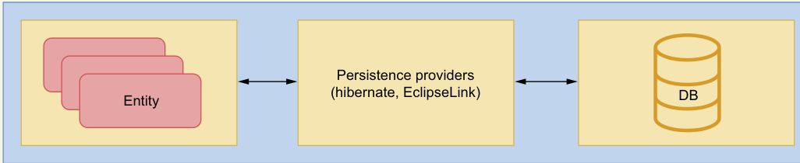
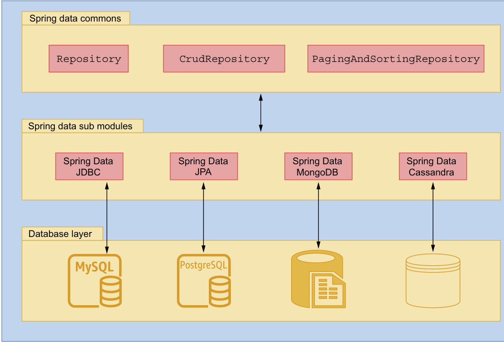
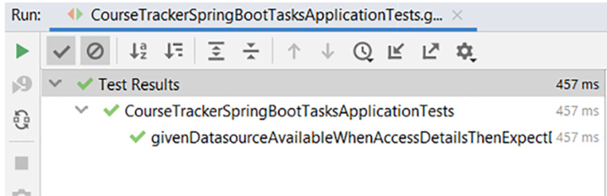
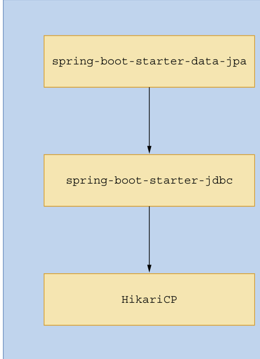

# 第 3 章 使用 Spring Data 进行数据库访问 (Database access with Spring Data)

### 本章内容涵盖

* 介绍 Spring Data 的概念、使用场景及其主要模块；
* 配置关系型数据库与 NoSQL 数据库（如 MongoDB），并在 Spring Boot 应用中访问数据；
* 启用 Spring Data JPA 以使用关系型数据库管理业务对象；
* 通过多种技术访问关系型数据库，包括 `@NamedQuery`、`@Query`、Criteria API 和 Querydsl。

现代应用程序几乎都需要数据库来存储应用数据，Spring Boot 应用也不例外。
在前两章中，我们学习了 Spring Boot 的基础概念、配置方式和运行机制。
有了这些基础，我们可以继续学习如何让应用与数据库交互。

在本章中，你将学习如何使用 **Spring Data** 与数据库通信。
我们将探索其配置方式、数据初始化、数据访问与对象管理的完整流程，
并体会到在 Spring Boot 中执行数据库操作的便捷性。

## 3.1 认识 Spring Data（Introducing Spring Data）

[Spring Data](https://spring.io/projects/spring-data) 是一个可以让你方便访问各种数据源的框架，包括关系型数据库与非关系型数据库（如 MongoDB）、MapReduce 数据库、以及云端数据服务等。

Spring Data 的目标是：  
提供一种统一、简单、熟悉的编程模型，让开发者在 Spring 体系中轻松实现数据访问。

Spring Data 是一个 “**伞形项目（umbrella project）**”，它包含多个子项目，每个子项目针对特定类型的数据库。

例如：

* **Spring Data JPA**：专注于关系型数据库（H2、MySQL、PostgreSQL 等）；
* **Spring Data MongoDB**：专注于 MongoDB 数据库。

### Java 持久化 API（Java Persistence API, JPA）

在现代应用中，程序通常需要与数据库通信以存储或读取数据。  
而传统的 JDBC 方式要求开发者编写大量模板代码，例如：

* 获取数据库连接；
* 定义 `PreparedStatement`；
* 设置参数；
* 执行查询；
* 管理资源关闭。

这些样板化步骤使得代码冗长且难以维护。

::: tip

**JPA（Java Persistence API）** 解决了这一问题。  
它在 Java 对象模型（例如业务实体类）与关系数据库模型（如表结构）之间建立了桥梁，从而实现了 **对象关系映射（Object-Relational Mapping, ORM）**。

如下图所示：



> 图 3.1 对象关系映射示意图
> 实体（Entity）表示业务对象，持久化提供者（Persistence Provider）负责实现 JPA 规范。

JPA 本身只是一个**规范（specification）**，定义了一套接口、类和注解。  
它的职责是规范化 ORM 技术，使得开发者可以轻松、统一地进行数据持久化操作。

常见的 JPA 实现包括：

* [**Hibernate**](https://hibernate.org/orm/)
* [**EclipseLink**](https://www.eclipse.org/eclipselink/#jpa)

这些框架提供了对 JPA 规范的具体实现，从而让我们能够在 Spring 应用中轻松地完成数据库持久化与对象操作。

:::

### 3.1.1 为什么选择 Spring Data（Why Spring Data）

Spring Data 的核心主题之一是提供一种一致的编程模型，用于访问各种数据源。  
因此，它提供了一个便捷的 API，使开发者可以为业务领域对象指定元数据（metadata），并确保这些对象能够被持久化到指定的数据存储中。

例如，你可以使用关系型数据库，并通过 **Spring Data JPA** 来管理业务对象。  
你可以在业务对象中添加 JPA 注解，而 Spring Data JPA 会确保这些领域对象被正确地持久化到数据库表中。  
在本章的后续部分中，你将会看到许多这类注解及其在业务对象中的用法。

Spring Data 各模块还以模板（template）类的形式提供 API，这种模式与 Spring 中常见的 `JdbcTemplate` 或 `JmsTemplate` 十分类似。  
例如，如果你使用的是 MongoDB，就可以使用 `MongoTemplate` 来在 MongoDB 数据库中执行各种操作。  
这些模板类提供了多种辅助方法，用于处理存储资源管理和异常转换（exception translation）等常见任务。

::: tip

**Spring templates**

Spring 模板类消除了原本在使用常见 API（例如 JDBC、JMS、JNDI）时所需编写的大量样板代码。  
这些样板代码通常包括：建立数据库连接、创建 `PreparedStatement`、执行查询、处理异常、关闭连接等。  
而 Spring 的模板类封装了这些步骤，让开发者可以专注于核心业务逻辑。

例如，使用 `JdbcTemplate` 时，你只需要提供要执行的 SQL 查询语句，其余的连接、执行、资源关闭等流程都由模板自动完成。

:::

Spring Data 还在所有支持的数据库之上提供了一个**仓库抽象层（repository abstraction layer）**，该抽象层为开发者提供了统一的编程模型。  
这个抽象层包含在 **Spring Data Commons** 模块中，并提供了一系列有用的接口，这些接口可用于执行标准的 CRUD 操作（创建 Create、读取 Read、更新 Update、删除 Delete）以及执行查询。

该抽象层位于 Spring Data 的最上层，同时也是其他所有 Spring Data 模块的基础。

### 3.1.2 Spring Data 模块（Spring Data Modules）

在前一节中，你已经了解了 Spring Data 的作用。  
在本节中，我们将进一步学习 Spring Data 的各个模块。  
你可以参考官方文档获取完整模块列表：
[https://spring.io/projects/spring-data](https://spring.io/projects/spring-data)

::: tip

**Spring Data modules**

Spring Data 是一个为多种主流数据存储系统提供支持的“伞形项目（umbrella project）”。   
表 3.1 总结了其中几个常用模块及其用途。

| 模块名称                                 | 用途                             |
| ------------------------------------ | ------------------------------ |
| **Spring Data Commons**              | 包含所有 Spring Data 项目中使用的基础组件。   |
| **Spring Data JDBC**                 | 提供基于 JDBC 的仓库支持。               |
| **Spring Data JPA**                  | 提供基于 JPA 的仓库支持。                |
| **Spring Data MongoDB**              | 提供基于文档的 MongoDB 数据库支持。         |
| **Spring Data REDIS**                | 提供 Redis 数据存储的支持。              |
| **Spring Data REST**                 | 允许将 Spring Data 仓库暴露为 REST 资源。 |
| **Spring Data for Apache Cassandra** | 提供 Apache Cassandra 数据库支持。     |

你可以参考 [Spring Data Reference](https://spring.io/projects/spring-data) 文档，查看完整的 Spring Data 项目列表。

:::

在所有模块中，**Spring Data Commons** 模块是最重要的一个。  
它由 Spring Data 的基础组件组成，这些组件与具体数据源无关，并被其他 Spring Data 模块复用。

例如：

* Spring Data JPA 模块依赖于 Spring Data Commons；
* Spring Data JPA 的 `JpaRepository` 接口是 Spring Data Commons 模块中 `PagingAndSortingRepository` 接口的子接口；
* 而 `PagingAndSortingRepository` 又继承了 `CrudRepository`；
* 通过这种继承关系，Spring Data Commons 提供了 CRUD、分页与排序的核心功能。

#### 图 3.2 Spring Data 模块结构（Spring Data Modules）



> **图 3.2** Spring Data 模块结构：
> Spring Data Commons 模块为其他子模块提供了基础，
> 每个子模块都面向特定类型的数据库（例如 MySQL、PostgreSQL、MongoDB）。
> `Repository`、`CrudRepository` 和 `PagingAndSortingRepository` 都是由 Commons 模块定义的接口。

Spring Data 的子模块包含针对特定数据库技术（例如 JDBC、JPA）或供应商（例如 MongoDB、Cassandra）的实现。  
这些子模块利用 Spring Data Commons 提供的核心框架特性，从而在不同数据库之间保持统一的编程体验。

## 3.2 在 Spring Boot 应用中配置数据库（Configuring a database in a Spring Boot application）

在任何应用中，配置并访问数据库都是一项基础操作，Spring Boot 应用也不例外。  
Spring Boot 提供了多种技术，帮助你在应用中配置并访问数据库。下面我们来看如何在 Spring Boot 应用中配置并访问一个关系型数据库。

### 3.2.1 技巧：在 Spring Boot 应用中配置关系型数据库（Technique: Configuring a relational database in a Spring Boot application）

在本技巧中，我们将演示如何在 Spring Boot 应用中配置关系型数据库。

#### 问题（Problem）

大多数应用都需要与数据库交互以存储和检索数据。但在与数据库通信之前，你必须先在应用中完成数据库配置。
你需要在 Spring Boot 应用中配置并访问一个关系型数据库。

#### 解决方案（Solution）

要在 Spring Boot 中配置关系型数据库，可以在 `pom.xml` 中添加 `spring-boot-starter-data-jpa` 与相应数据库驱动依赖。  
此外，你还需要提供数据库连接的详细信息，例如用户名、密码、驱动类以及连接 URL。

::: tip

**使用哪种关系型数据库？**

在演示中，我们使用内存型关系数据库 [**H2**](https://www.h2database.com/html/main.html)。
当然，你也可以使用任何其他关系型数据库继续完成本技巧，例如 [MySQL](https://www.mysql.com/)、[Oracle](http://mng.bz/y4xB) 或 [PostgreSQL](https://www.postgresql.org/)。   
除了更换数据库驱动及相关配置参数外，配置步骤保持一致。

需要保证你所使用的数据库实例正在运行，以便 Spring Boot 应用能够连接到它。你可以在本地安装并配置数据库，也可以使用来自云服务商（如 AWS、Azure）的数据库实例。  
对于云端数据库，你只需更换连接 URL，其他配置保持不变。本示例使用嵌入式的 H2 内存数据库。

源代码（Source code）  
可在配套 GitHub 仓库获取本技巧所用 Spring Boot 项目的[基础版本](https://github.com/honkinglin/spring-boot-in-practice/tree/main/ch03/configuring-relational-database/course-tracker-start) 和 [完成版项目](https://github.com/honkinglin/spring-boot-in-practice/tree/main/ch03/configuring-relational-database/course-tracker-final)。

:::

在 `pom.xml` 中添加如下两个依赖（可放在 `<dependencies>` 任意位置）：

```xml
<!-- Listing 3.1 Spring Data JPA starter 和 H2 依赖 -->
<dependency>
    <groupId>org.springframework.boot</groupId>
    <artifactId>spring-boot-starter-data-jpa</artifactId>
</dependency>

<dependency>
    <groupId>com.h2database</groupId>
    <artifactId>h2</artifactId>
    <scope>runtime</scope>
</dependency>
```

在清单 3.1 中，第一条依赖引入 Spring Data JPA，第二条依赖则将 H2 数据库驱动加入到项目中。   
如果使用除 H2 以外的数据库，请在 `pom.xml` 中加入对应的数据库驱动依赖（可在 Maven Central 查找）。

其中，Spring Data JPA 让你可以通过 ORM 技术在无需显式编写 SQL 的情况下管理业务领域对象；   
而 H2 的内存模式允许你在 Spring Boot 应用中使用嵌入式数据库（数据会在应用重启时清空）。

接下来在应用的 `application.properties` 中添加 H2 的连接信息：

```properties
# Listing 3.2 带有 H2 数据库配置的应用属性
spring.datasource.url=jdbc:h2:mem:sbipdb       # 数据库 URL（本示例使用 sbipdb schema）
spring.datasource.driverClassName=org.h2.Driver # H2 驱动类
spring.datasource.username=sa                   # 数据库用户名
spring.datasource.password=password             # 数据库密码
spring.h2.console.enabled=true                  # 启用 H2 控制台（仅 H2 可用）
```

清单 3.2 中提供了 H2 的连接 URL、驱动类、用户名、密码，并启用了 H2 控制台。  
H2 控制台提供了一个基于浏览器的 UI，可在内存数据库中执行 SQL。  
这些配置足以让 Spring Boot 在应用中创建并配置数据源。

为验证数据源是否正确创建，定义一个简单的单元测试，断言数据源类型与底层数据库产品名称（清单 3.3）：

```java
// Listing 3.3 用单元测试验证数据源细节
package com.manning.sbip.ch03;

// 省略 import 语句以保持可读性

@SpringBootTest
class CourseTrackerSpringBootApplicationTests {

    @Autowired
    private javax.sql.DataSource dataSource;

    @Test
    void givenDatasourceAvailableWhenAccessDetailsThenExpectDetails() throws java.sql.SQLException {
        // 断言数据源实现类为 HikariCP
        org.assertj.core.api.Assertions.assertThat(dataSource.getClass().getName())
            .isEqualTo("com.zaxxer.hikari.HikariDataSource");

        // 断言底层数据库产品名称为 H2
        org.assertj.core.api.Assertions.assertThat(
                dataSource.getConnection().getMetaData().getDatabaseProductName())
            .isEqualTo("H2");
    }
}
```

执行该测试用例后，你会看到两个断言均通过（见图 3.3）。



> 图 3.3 在 IntelliJ IDEA 中成功执行的单元测试（Unit test case executed successfully in IntelliJ IDEA）

#### 讨论（Discussion）

通过本技巧，你学习了如何用少量配置在 Spring Boot 应用中配置关系型数据库。  
例如，`application.properties` 中的数据库配置参数，加上类路径中的 Spring Data JPA 与 H2 驱动 jar，就能让 Spring Boot 在应用中配置一个 H2 数据源。  
此数据源即可被应用用于数据库通信。

作为数据库配置的一部分，Spring Boot 会自动配置 [**HikariCP**](https://github.com/brettwooldridge/HikariCP) 作为数据库连接池。  
连接池在应用启动时创建一组数据库连接，供应用复用。这样每次需要数据库连接时无需重新创建与销毁，使用后将连接归还连接池即可。Spring Boot 默认使用 HikariCP 作为连接池实现。

如果你想了解 HikariCP 依赖从何而来，可以在 IDE 中打开示例应用的 `pom.xml`，查看 `spring-boot-starter-data-jpa` 依赖的传递依赖关系：  
`spring-boot-starter-data-jpa` 依赖于 `spring-boot-starter-jdbc`，而后者又依赖 HikariCP（见图 3.4）。



> 图 3.4 HikariCP 连接池库的传递依赖（HikariCP connection pool library transitive dependency）

若需使用 HikariCP 以外的连接池库，可以在 `spring-boot-starter-data-jpa` 依赖上排除 HikariCP，并加入你选择的连接池库（如 Oracle UCP、Tomcat JDBC、DBCP2 等）。
清单 3.4 展示了如何排除 HikariCP 并改用 `tomcat-jdbc`：

```xml
<!-- Listing 3.4 在 POM 中排除 HikariCP 并加入 Tomcat 连接池 -->
<dependency>
    <groupId>org.springframework.boot</groupId>
    <artifactId>spring-boot-starter-data-jpa</artifactId>
    <exclusions>
        <exclusion>
            <groupId>com.zaxxer</groupId>
            <artifactId>HikariCP</artifactId>
        </exclusion>
    </exclusions>
</dependency>

<dependency>
    <groupId>org.apache.tomcat</groupId>
    <artifactId>tomcat-jdbc</artifactId>
</dependency>
```

基于清单 3.4 的配置，Spring Boot 选择连接池实现的策略如下：

1. 如果 **HikariCP** 不可用，而类路径中存在 **Apache Tomcat** 的连接池依赖，则使用 Tomcat 连接池。
2. 若 HikariCP 和 Apache Tomcat 连接池依赖都不可用，则尝试使用 [**Apache Commons DBCP2**](https://commons.apache.org/proper/commons-dbcp)。
3. 如果 DBCP2 也不可用，Spring Boot 会配置 JDK 的默认数据源（`javax.sql.DataSource`）。

在本技巧中，我们通过在 `application.properties` 中配置少量参数，使 H2 数据库在 Spring Boot 应用中可用。实际上，Spring Boot 还提供了大量可选配置以便对数据库配置进行微调。

例如，若使用默认的 HikariCP，你可能希望自定义连接池大小：可通过 `spring.datasource.hikari.maximum-pool-size` 指定每个池的最大连接数。    
如果使用其他连接池库，则需要配置对应库的特定属性。

若想进一步了解可用的数据库配置参数，可参考 [Spring Boot 文档](https://docs.spring.io/spring-boot/appendix/application-properties/index.html#appendix.application-properties.data) 的应用属性说明。
